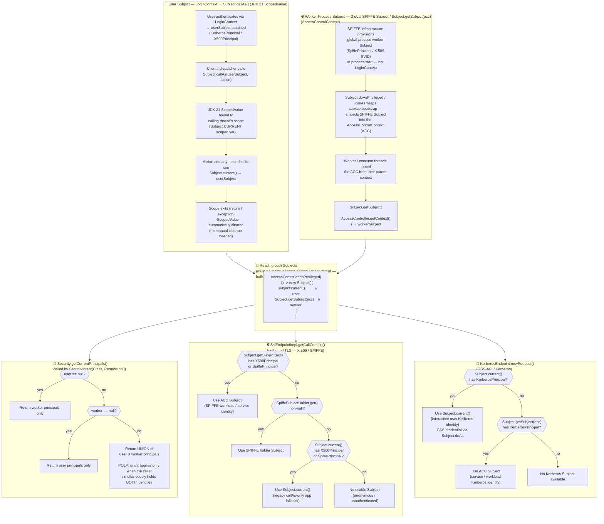

# Subject.callAs (User Subject) vs Subject.doAs (Worker Process Subject)

This document illustrates the two complementary Subject-propagation mechanisms used in JGDMS and
how they are consumed together by the security infrastructure.

---

## Flowchart

---

## Summary table

| Aspect | `Subject.callAs()` — User Subject | `Subject.getSubject(acc)` — Worker Subject |
|---|---|---|
| **Storage mechanism** | JDK 21 `ScopedValue` (thread-local, lexically scoped) | `AccessControlContext` (inherited by child threads) |
| **Propagates to child threads?** | No — scope is strictly per-calling-thread | Yes — child threads inherit the parent ACC |
| **Lifetime** | Lexical scope of the `callAs` lambda | Lifetime of any thread that holds the parent ACC |
| **Who sets it** | `LoginContext` authenticates the user; `Subject.callAs` binds per-request (e.g. `BasicInvocationDispatcher` on dispatch; event tasks in `RegistrarImpl.pendingEvent`) | **SPIFFE infrastructure** provisions a global process SVID (`SpiffePrincipal` / X.509) at process start — `Subject.doAsPrivileged` embeds it into the ACC |
| **Read API** | `Subject.current()` | `Subject.getSubject(AccessController.getContext())` |
| **Must be inside `doPrivileged`?** | Yes — triggers a permission check | Yes — triggers a permission check |
| **Typical principal types** | `KerberosPrincipal`, `X500Principal` (human user) | `SpiffePrincipal`, `X500Principal` (SPIFFE workload SVID) |
| **TLS credential priority (SSL)** | Checked last (legacy fallback only if has X500/SPIFFE) | Checked first |
| **Kerberos credential priority** | Checked first (user wins) | Checked second |
| **`Security.grant` behaviour** | Principals consulted by `Security.getCurrentPrincipals()` | Principals consulted by `Security.getCurrentPrincipals()` |
| **When both present** | Principal sets are **unioned** — grant fires only when the caller simultaneously holds *both* the user identity and the workload identity, enforcing Principle of Least Privilege (POLP) |

---

## Relevant source locations

| File | What it does |
|---|---|
| `jgdms-jeri/.../BasicInvocationDispatcher.java` | Calls `Subject.callAs(clientSubject, action)` on every inbound RPC dispatch (`invokeWithClientSubject`) |
| `jgdms-jeri/.../BasicInvocationHandler.java` | Reads `Subject.current()` (`getUserPrincipals`) for outbound calls |
| `jgdms-service-support/.../AbstractJiniService.java` | Wraps service bootstrap with `Subject.doAsPrivileged` to embed the SPIFFE worker Subject into the ACC |
| `jgdms-platform/.../Security.java:1233–1277` | `getCurrentPrincipals()` — unions user + worker principals inside a single `doPrivileged` |
| `jgdms-jeri/.../SslEndpointImpl.java:278–325` | ACC Subject (SPIFFE) → SPIFFE holder → `Subject.current()` priority chain for TLS |
| `jgdms-jeri/.../KerberosEndpoint.java:638–655` | `Subject.current()` → ACC Subject priority chain for Kerberos GSS |
| `services/reggie/.../RegistrarImpl.java` | `EventReg` captures `Subject.current()` in constructor; `pendingEvent()` re-applies it via `Subject.callAs` |
