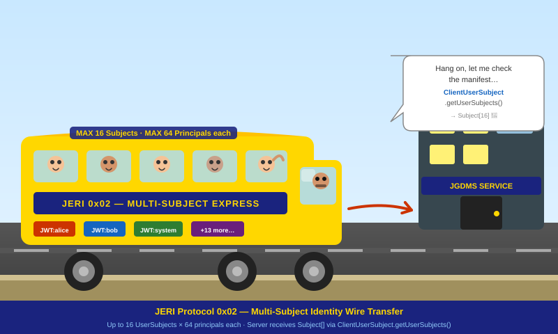
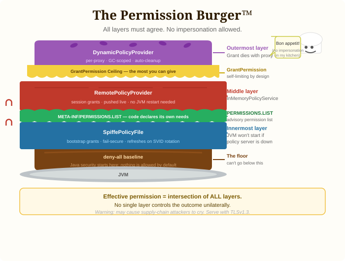

# JGDMS & DirtyChai: Secure, Scalable, Dynamically Discoverable Microservices for the JVM

> **Reading guide**
> - **Evaluating the platform?** Start with the [Executive Summary](#executive-summary) and [What JGDMS Is Not](#what-jgdms-is-not).
> - **Architecting a deployment?** Continue through [Security: Baked In, Not Bolted On](#security-baked-in-not-bolted-on), [SCAP](#the-safe-codebase-audit-pipeline-scap), and [Discovery](#discovery-zero-infrastructure-to-enterprise-scale).
> - **Integrating or extending the platform?** The [Technical Reference](#appendix-technical-reference) appendix covers wire-protocol internals and implementation details.

---

## Executive Summary

Modern distributed systems face an uncomfortable trade-off: the more open and composable a platform
is, the harder it becomes to secure. Remote code loading, serialized objects crossing trust
boundaries, and third-party service proxies all expand the attack surface. Most platforms paper over
these problems with network-level firewalls and hope for the best.

**JGDMS** (*Jini Global Distributed Micro Services*) and its companion JDK fork **DirtyChai** take
a different path: they embed security deep into the infrastructure itself — in the transport, the
serialization mechanism, the policy engine, and the codebase loading pipeline — while simultaneously
delivering the performance and scalability needed for production distributed systems.

### The Two Projects and How They Relate

| Project | What it is | Why it exists |
|---|---|---|
| **JGDMS** | A security-hardened fork of [Apache River](https://river.apache.org/) (née Jini) | Provides secure, dynamically-discoverable microservices for the JVM |
| **DirtyChai** | A community fork of OpenJDK | Restores and extends Java's authorization APIs (removed in Java 24); adds `SecurityManager` support for virtual threads; required to run JGDMS |

The two projects are complementary forks of *different* upstreams. JGDMS forks Apache River;
DirtyChai forks OpenJDK. Running JGDMS on DirtyChai gives you the full security and scalability
story. Running JGDMS on bare OpenJDK is **not supported**: on standard OpenJDK ≤ 23, virtual
threads are allocated an `AccessControlContext` with no permissions when `SecurityManager` is
enabled, making them non-functional in a security context. On OpenJDK 24+, the `SecurityManager`
API was removed entirely. DirtyChai is required for all supported deployments.

### Scalability in One Sentence

> **DirtyChai scales vertically. JGDMS scales horizontally.**

DirtyChai unlocks vertical scale: virtual threads with `SecurityManager` enabled (a combination
OpenJDK never achieved), a lock-free policy provider with less than 1% authorization overhead, and
SPIFFE-managed short-lived credentials that rotate without JVM restarts.

JGDMS unlocks horizontal scale: stateless analysis engines that self-register and are automatically
load-balanced, replicated Lookup Services, lease-based cleanup that requires no manual intervention,
and a Verdict Registry keyed by content hash rather than URL so the same JAR is analyzed once
regardless of how many services serve it.

The two properties reinforce each other: a single secure node is DirtyChai's story; a fleet of
those nodes that self-assembles, self-heals, and self-authorizes is JGDMS's story.

### What You Get Out of the Box

| Concern | Answer |
|---|---|
| Transport security | TLSv1.3 with per-method constraints, mutual authentication via SPIFFE SVIDs |
| Deserialization safety | `@AtomicSerial`: validation before construction, atomic invariant checking |
| Authorization | Three-layer policy stack, lock-free `ConcurrentPolicyFile`, dynamic grants |
| Code integrity | SCAP five-host pipeline, quorum `RegistryVerdict`, signed `JarAnalysisReport` |
| Content-hash grants | `DigestGrant` + `DigestCodeSource`: grants conditioned on SHA-256 JAR hash, not just URL |
| User identity | JWT/OIDC via `JwtLoginModule`/`JwtPrincipal`; sealed `UserSubject`; per-request `callAs` |
| Multi-user calls | JERI protocol `0x02`: up to 16 `UserSubject`s × 64 principals per call; `SettleTransactionPermission` extends this to distributed transaction commit/abort |
| Subject propagation | `SubjectAwareExecutor` captures and restores `Subject` + security context on worker threads |
| Workload identity | Sealed `WorkerSubject` (SPIFFE SVID), ambient in every `ProtectionDomain` |
| Credential management | SPIFFE/SPIRE: short-lived SVIDs, automatic rotation, no keystores |
| Service discovery | IPv6 unicast + multicast, `LookupLocator("jini://lookup.domain:4160")` |
| Horizontal scale | Stateless BAE pool (add instances freely), replicated Lookup Services |
| Vertical scale | Lock-free policy provider (<1% overhead), faster-than-RMI JERI, virtual threads |
| Operational simplicity | SPIRE manages identities, externalised Jini configuration, lease-based cleanup |

---

## What Is JGDMS?

**JGDMS** is described in its own project descriptor as:

> *"Infrastructure for providing secured micro services, that are dynamically discoverable and
> searchable over IPv6 networks."*

Where RPC frameworks stop at "call a remote method," JGDMS goes further: services announce
themselves on IPv6 networks, clients discover them by capability rather than by hard-wired address,
and trust is established cryptographically before any code runs. Three pillars shape every design
decision:

1. **Jini-model service discovery** — lease-based registrations, multicast and unicast lookup,
   event-driven service notifications.
2. **JERI (Jini Extensible Remote Invocation)** — a pluggable, constraint-based RPC layer that
   supersedes standard Java RMI with pluggable transport, per-method security requirements, and
   authenticated dispatch.
3. **Defence-in-depth security** — hardened deserialization, TLSv1.3 transport, Java authorization,
   proxy trust verification, and a novel codebase safety pipeline that analyzes third-party
   bytecode before it is ever loaded.

---

## What Is DirtyChai?

**DirtyChai** is a community fork of OpenJDK that restores, improves, and extends Java's
authorization infrastructure — the `SecurityManager`, `AccessController`, and `ProtectionDomain`
APIs that OpenJDK deprecated in Java 17 and removed entirely in Java 24.

Without these APIs you cannot restrict what code from a particular source can do once it is loaded.
DirtyChai's goal is not to safely run *untrusted* code (it is not a sandbox) but to ensure that
*trusted but independent* parties operate only within their declared and granted privileges. Its key
design goals are:

- Prevent loading of untrusted code (`LoadClassPermission`)
- Break deserialization gadget attack chains (`SerialObjectPermission`)
- Block native code injection (`NativeInvocationPermission`, `NativeMemoryPermission`)
- Maintain and extend permission guard hooks
- High performance and vertical scalability with virtual threads — fixed in DirtyChai by caching
  immutable `AccessControlContext` instances (minimising ACC object creation) and introducing
  `DomainIdentity`, a `ProtectionDomain` subclass that implements `equals` and `hashCode` to
  support `SubjectDomainCombiner` and minimise duplication of `ProtectionDomain` instances that
  rely on object identity. On bare OpenJDK ≤ 23, virtual threads are assigned an
  `AccessControlContext` with no permissions when `SecurityManager` is enabled, making them
  non-functional in a security context.
- Community redesign of the Authorization API for potential inclusion in OpenJDK mainline
- `SpiffeX509TrustManager` and `SpiffeX509KeyManager` — SPIFFE/SPIRE zero-touch certificate management

DirtyChai is required to run JGDMS: it restores the full authorization semantics, enables virtual
threads with `SecurityManager` support, and provides SPIFFE support, `JarFile` hardening against
untrusted input, and the multi-Subject dispatch varargs API.


---

## What JGDMS Is Not

JGDMS is **not** a sandbox for running untrusted code. It will not safely isolate malicious
bytecode. Its goal is the opposite: prevent untrusted code from ever being loaded, using
`LoadClassPermission` as the primary gate and SCAP as the pre-analysis pipeline. If you need to
run code you don't trust, you need a different tool.

JGDMS **requires DirtyChai**. Running on bare OpenJDK is not supported: on standard OpenJDK ≤ 23,
virtual threads are assigned an `AccessControlContext` with no permissions when `SecurityManager`
is enabled, which prevents their use in a security context. On OpenJDK 24+, the `SecurityManager`
API was removed entirely. DirtyChai is the only supported JDK.

---

## Quick Start: A Minimal JGDMS Deployment

> **Technical Detail** — skip if you are still evaluating.

The fastest path to a running JGDMS service is a `ServiceStarter` configuration that specifies
which services to launch, which endpoint to export, and what method constraints to enforce.

### Step 1 — Define the service interface with method constraints

```java
// HelloService.java — the remote interface
public interface HelloService extends Remote {
    String greet(String name) throws RemoteException;
}

// HelloServiceConstraints.java — per-method security requirements
InvocationConstraints constraints = new InvocationConstraints(
    Arrays.asList(
        ServerAuthentication.YES,    // server must present a valid certificate
        ClientAuthentication.YES,    // client must authenticate
        Confidentiality.YES,         // TLSv1.3 encryption
        Integrity.YES,               // MAC-covered
        AtomicInputValidation.YES    // hardened deserialization for all arguments
    ),
    Collections.emptyList()
);
MethodConstraints methodConstraints =
    new BasicMethodConstraints(new DefaultMethodConstraints(constraints));
```

### Step 2 — Write the ServiceStarter configuration

```
// hello-service.config — Jini configuration file
import net.jini.jeri.*;
import net.jini.jeri.ssl.*;
import net.jini.core.constraint.*;

com.sun.jini.start {
    serviceDescriptors = new ServiceDescriptor[] {
        new NonActivatableServiceDescriptor(
            "file:hello-service-impl.jar",          // implementation JAR
            "file:hello-service-dl.jar",            // downloadable proxy JAR
            "net.example.HelloServiceImpl",         // implementation class
            new String[]{ "hello-service.config" } // configuration passed to service
        )
    };
}

net.example.HelloServiceImpl {
    serverExporter = new BasicJeriExporter(
        SslServerEndpoint.getInstance(0),           // TLS on a random port
        new BasicILFactory(methodConstraints, null) // enforce constraints on every call
    );
}
```

### Step 3 — Launch

```sh
java -Djava.security.policy=start-service.policy \
     -jar lib/start.jar hello-service.config
```

The service self-registers with the Jini Lookup Service at `lookup.example.org:4160`. Any client
that discovers the lookup service can find `HelloService` by interface type — no hard-wired
addresses, no service registry configuration.

---

## Security: Baked In, Not Bolted On

### TLSv1.3 Transport With Authenticated Dispatch

Every JGDMS service communication happens over JERI. JERI is not just a wire protocol — it is a
*constraint system*. Each service proxy carries a set of `MethodConstraints` that declare the
security requirements for every method call:

| Constraint | Effect |
|---|---|
| `ServerAuthentication.YES` | The remote endpoint must present a verifiable certificate |
| `ClientAuthentication.YES` | The client must authenticate itself to the server |
| `Confidentiality.YES` | All bytes in flight must be encrypted |
| `Integrity.YES` | All bytes in flight must be covered by a MAC or digital signature |
| `AtomicInputValidation.YES` | The server must use hardened deserialization for all arguments |
| `ConfidentialityStrength.STRONG` | Cipher suite must meet a minimum key-strength threshold |

Any call that cannot satisfy its declared requirements throws `UnsupportedConstraintException`
*before* bytes leave the client JVM. Security requirements are enforced by construction, not by
convention.

The SSL endpoint supports TLSv1.3 with X.509 certificates. Every server-side dispatch thread
automatically carries the **SPIFFE Worker `Subject`** of the calling client for the lifetime of the
remote method invocation. Service implementations do not write authentication boilerplate — the
infrastructure guarantees the authenticated identity is on the thread.

### SPIFFE/SPIRE: Zero-Touch Certificate Management

In a fleet of services, long-lived keystores are a management and security liability. JGDMS and
DirtyChai integrate [SPIFFE](https://spiffe.io/) workload identity via SPIRE. Each host process and
client JVM receives a short-lived (~1 hour) X.509 SVID (SPIFFE Verifiable Identity Document) from
a local SPIRE agent.

The `SpiffeCredentialManager` component:
- Opens the SPIRE Workload API socket on startup
- Populates an in-memory `Subject` with the current X.509 certificate and private key (no
  filesystem keystore)
- Rotates credentials automatically when the SVID nears expiry
- Triggers policy refresh on each rotation

No `keytool`, no PKCS#12 files, no manual certificate renewal. Each service's identity is managed
by the SPIRE control plane — revocation and rotation happen without JVM restarts.

### Sealed Subject Hierarchy: Three Identity Layers

DirtyChai introduces a sealed `Subject` hierarchy with three distinct identity layers, each with
its own carrier, lifetime, and routing rule:

```
┌─────────────────────────────────────────────────────────────────────┐
│                    DirtyChai Subject Hierarchy                      │
│                                                                     │
│  Subject (vanilla, legacy)                                          │
│   ├── WorkerSubject  (sealed, permits SpiffeSubject only)           │
│   │     • Process workload identity (SPIFFE SVID)                   │
│   │     • Baked into every ProtectionDomain at class-load time      │
│   │     • AMBIENT — survives all doPrivileged boundaries            │
│   │     • Never passed to callAs() or doAs() — illegal              │
│   │                                                                 │
│   └── UserSubject  (final)                                          │
│         • Human user identity (JWT/OIDC)                            │
│         • Carried in SCOPED_SUBJECT ScopedValue<Subject[]>          │
│         • Installed per-request via Subject.callAs(...)             │
│         • Injected into ProtectionDomain array by AccessController  │
└─────────────────────────────────────────────────────────────────────┘

┌─────────────────────────────────────────────────────────────────────┐
│               Three Identity Layers on a Dispatch Thread            │
│                                                                     │
│  Layer 1 — Process Worker  (WorkerSubject, ambient)                 │
│    RFC3986URLClassLoader / PreferredClassLoader inject the          │
│    server's Principal[]; DirtyChai SecureClassLoader injects the    │
│    client's Principal[] + DigestCodeSource at class-load time.      │
│    Always present at every checkPermission. Never reinstalled.      │
│                                                                     │
│  Layer 2 — Remote Process  (serialized ACC ProtectionDomains)       │
│    Remote client's WorkerSubject principals travel inside a         │
│    serialized AccessControlContext over the JERI wire.              │
│    Unverifiable domains are encoded as anonCount; the receiver      │
│    reconstructs anonymous placeholder domains. Shed at doPrivileged.│
│                                                                     │
│  Layer 3 — User  (UserSubject via callAs)                           │
│    Per-request human identity bound by JERI dispatcher via          │
│    Subject.callAs(userSubject, () -> invoke(...)).                  │
│    AccessController.getContext() bakes user principals directly     │
│    into the ProtectionDomain array. Survives doPrivileged.          │
└─────────────────────────────────────────────────────────────────────┘
```

**User Subject** (`UserSubject`) represents a human user. User identity is established via
**JWT/OIDC** using `JwtLoginModule` from the `jgdms-security-jwt` module. The resulting
`UserSubject` carries `JwtPrincipal` instances (e.g. `"sub:alice@example.org"`,
`"group:admins"`) and is installed per-request via `Subject.callAs(jwtUserSubject, () -> ...)`.
Kerberos is supported for legacy deployments. The JERI layer supports up to 16 user Subjects per
call (see [Multi-Subject Wire Protocol](#multi-subject-wire-protocol) in the appendix for wire
details).

Service code retrieves all received user Subjects from the server context:

```java
// inside a dispatched service method:
ClientUserSubject cus = (ClientUserSubject)
    ServerContext.getServerContextElement(ClientUserSubject.class);
Subject[] users = cus.getUserSubjects();  // all wire-transferred Subjects
Subject primary = cus.getUserSubject();   // subjects[0] — convenience for single-user callers
```

This makes it possible for a single RPC to carry both an end-user's JWT identity and a
delegation-chain Subject, without any out-of-band negotiation. Alternatively, policy can require
multiple principals to be simultaneously present for a transaction to complete.

The same multi-Subject model extends to distributed transactions: `SettleTransactionPermission`
captures all participant `Subject`s at join time and checks the full set before permitting commit
or abort. See [SettleTransactionPermission](#settletransactionpermission) in the appendix.



**Process Worker Subject** (`WorkerSubject`) represents the JVM process itself. With SPIFFE/SPIRE,
DirtyChai's `SpiffeCredentialManager` constructs a sealed `SpiffeSubject extends WorkerSubject` and
bakes it into every `ProtectionDomain` at class-load time. This Subject contains:

- A `SpiffePrincipal` derived from the SVID URI SAN (e.g.
  `spiffe://jgdms.example.org/host/bae/engine-2`)
- An `X500Principal` derived from the certificate Subject DN
- The short-lived X.509 credential (certificate chain + private key) — never written to disk

On DirtyChai, JGDMS's `RFC3986URLClassLoader` and `PreferredClassLoader` carry the server's
`Principal[]` as a `final` field and inject it into each `ProtectionDomain`; DirtyChai's
`SecureClassLoader` simultaneously injects the client's process `Principal[]` and `DigestCodeSource`
(the codebase's SHA-256 hash). The resulting proxy `ProtectionDomain` therefore carries both the
server's and client's JVM process principals alongside the codebase digest, enabling policy decisions
that span both sides of the call. See
[ProtectionDomain Principal Injection](#protectiondomain-principal-injection) in the appendix for
implementation details.

Because the `WorkerSubject` is **ambient** — present in every `ProtectionDomain` regardless of
`doPrivileged` nesting — the server never needs to reinstall it per request.

**Remote process identity** travels differently: the remote client's `WorkerSubject` principals are
carried inside a serialized `AccessControlContext` transmitted over the JERI wire.
`AccessControlContextSerializer` encodes verifiable (`httpmd:` / `DigestCodeSource`) domains by
identity and counts unverifiable domains as `anonCount`. On the receiving JVM, verifiable domains
are SHA-256–checked and unverifiable ones are reconstructed as anonymous placeholder
`ProtectionDomain`s — preserving their permission ceilings without asserting a specific identity.
All domains are shed at `doPrivileged` boundaries.

No session state, no thread-local leakage between calls, no boilerplate in service code.

### Hardened Deserialization: `@AtomicSerial`

Java object deserialization is one of the richest attack surfaces in enterprise software. JGDMS
replaces standard `Serializable`/`readObject` with `@AtomicSerial` — an annotation and constructor
protocol that requires:

1. A `(GetArg)` constructor whose **first action** is calling a static `check(GetArg)` method to
   validate all field values *before* any field is assigned.
2. A `static SerialForm[] serialForm()` method declaring the expected serial shape.
3. Complete prevention of three classic deserialization vulnerabilities:
   - Instantiation of arbitrary classes via stream manipulation
   - Denial of service via circular reference or OOME
   - Reference theft from a partially-constructed object

When the `AtomicInputValidation.YES` constraint is in effect, the JERI dispatcher switches to
`AtomicMarshalInputStream`, ensuring every deserialized argument across the wire has passed its
invariant checks.

### Content-Hash Policy Grants: `DigestGrant` and `DigestCodeSource`

A URL is not a reliable security boundary — the same URL can serve different bytes after a CDN
update or supply-chain compromise. DirtyChai extends the policy language with two new types that
condition grants on the **SHA-256 content hash of the JAR**, not merely its URL:

- **`DigestCodeSource`** — a `CodeSource` subclass that carries the JAR's `byte[] digest` and
  `String digestAlgorithm`. `SecureClassLoader` populates this when loading from a
  content-verified JAR.
- **`DigestGrant extends URIGrant`** — a policy grant that checks the URI first and then verifies
  `DigestCodeSource.getDigest()` matches. Expressed in policy files as:

```
grant digest "SHA-256:4e07408562bedb8b60ce05c1decafe11",
      codeBase "https://repo.example.org/order-processor.jar"
      principal net.jini.security.jwt.JwtPrincipal "sub:alice@example.org" {
    permission net.jini.security.AccessPermission "submitOrder";
};
```

Even if an attacker replaces the JAR at the same URL, the content hash does not match and the
grant simply does not apply. `DigestGrant` is integrated with `PermissionGrantBuilder` and
`DefaultPolicyScanner`/`DefaultPolicyParser` so the full `SecurityPolicyWriter` → policy-file
round-trip works transparently.

### Three-Layer Authorization Stack

Authorization in JGDMS is not a single on/off switch. It is a composable stack of three policy
providers:

```
┌──────────────────────────────────────────────────────────────────────────┐
│                  Three-Layer Policy Stack (outermost first)              │
│                                                                          │
│  ┌────────────────────────────────────────────────────────────────────┐  │
│  │  DynamicPolicyProvider  (per-proxy, GC-scoped grants)              │  │
│  │    • Security.grant() called at proxy-preparation time             │  │
│  │    • Grant dies when proxy is garbage-collected (auto-cleanup)     │  │
│  │    • Hot path is write-free (sweeper runs every 60 s)              │  │
│  │  ┌──────────────────────────────────────────────────────────────┐  │  │
│  │  │  RemotePolicyProvider  (djinn-wide, session grants)          │  │  │
│  │  │    • Grants pushed live from InMemoryPolicyService           │  │  │
│  │  │    • replace() via RemoteEvent — no service restart needed   │  │  │
│  │  │  ┌────────────────────────────────────────────────────────┐  │  │  │
│  │  │  │  SpiffePolicyFile  (bootstrap, JVM lifetime)           │  │  │  │
│  │  │  │    • Fetched from HTTPS server authenticated by SVID   │  │  │  │
│  │  │  │    • Fail-secure: JVM won't start if server down       │  │  │  │
│  │  │  │    • Refreshes on every SVID rotation (~1 hour)        │  │  │  │
│  │  │  └────────────────────────────────────────────────────────┘  │  │  │
│  │  └──────────────────────────────────────────────────────────────┘  │  │
│  └────────────────────────────────────────────────────────────────────┘  │
└──────────────────────────────────────────────────────────────────────────┘

┌──────────────────────────────────────────────────────────────────────────┐
│              Three-Way Permission Intersection at Grant Time             │
│                                                                          │
│   What the proxy's ClassLoader declares   (META-INF/PERMISSIONS.LIST)    │
│                       ∩                                                  │
│   What the caller is authorised to give   (GrantPermission ceiling       │
│                                            in RemotePolicyProvider)      │
│                       ∩                                                  │
│   What the SPIFFE principal scope permits (principal scoping on          │
│                                            DynamicPolicyProvider grant)  │
│                       =                                                  │
│   Effective dynamic grant, scoped to this specific authenticated         │
│   endpoint instance.  No single party controls the outcome.              │
└──────────────────────────────────────────────────────────────────────────┘
```

| Layer | Grant issuer | Grant lifetime | Revocation |
|---|---|---|---|
| `SpiffePolicyFile` | Operator (HTTPS bootstrap server) | JVM lifetime | `refresh()` on SVID rotation |
| `RemotePolicyProvider` | Administrator via `InMemoryPolicyService` | Djinn session | `replace()` via `RemoteEvent` |
| `DynamicPolicyProvider` | Client via `VerifyingProxyPreparer` + `GrantPermission` | Proxy reachability | Automatic on GC |

The effective permission for any codebase is the **intersection** of what the code declares it
needs (`PERMISSIONS.LIST`), what the grant ceiling allows (`GrantPermission`), and what the SPIFFE
principal scope permits. No single party controls the outcome unilaterally — a supply-chain
compromise of one component cannot silently escalate its own privileges.

A grant targeting both a SPIFFE workload principal and a human JWT principal prevents privilege
escalation even if one axis is compromised:

```
// JWT/OIDC — preferred user identity
grant codeBase "httpmd://repo.example.org/order-processor.jar#SHA256:abc123"
      principal net.jini.security.jwt.JwtPrincipal "sub:alice@example.org"
      principal net.jini.jeri.ssl.SpiffePrincipal "spiffe://.../svc/order-processor" {
    permission net.jini.security.AccessPermission "submitOrder";
};
```

This grant applies only when *alice* is using *specifically the order-processor workload* to access
the JAR with that exact SHA-256 content hash. An attacker who controls one axis (e.g. replaces the
JAR at the same URL) still cannot match all three.



> **See also:** [Diagram 2 — Three-layer policy stack](<Big picture security architecture/diagram2_three_layer_policy_stack.svg>) · [Diagram 4 — GrantPermission & role management](<Big picture security architecture/diagram4_grantpermission_role_management.svg>)

---

## The Safe Codebase Audit Pipeline (SCAP)

One of JGDMS's most distinctive features is SCAP — a five-host architecture that audits every
third-party JAR for safety *before any client ever deserializes an object from it*.

### Why This Matters

A distributed Java system that loads remote code is exposed to supply-chain attacks: an attacker
replaces a legitimate JAR with one containing malicious or denial-of-service bytecode. Blocking
class initializers (`<clinit>`) are a particularly subtle liveness attack: they can pin virtual
thread carrier threads or hold the JVM class-loading lock, causing complete scheduler stalls with
as few concurrent requests as `Runtime.availableProcessors()`.

Code repositories assembled prior to runtime are also subject to library vulnerabilities and
transient dependency vulnerabilities.


### The Five Hosts

```
┌──────────────────────────────────────────────────────────────────────────────┐
│                  Safe Codebase Audit Pipeline (SCAP)                         │
│                                                                              │
│  Host 1 — Jini Lookup Service                                                │
│    Stores marshalled service items opaquely.                                 │
│    Fires events when new services register.           ◄──── clients query    │
│           │                                                                  │
│           │ new service registered (event)                                   │
│           ▼                                                                  │
│  Host 4 — Codebase Downloader  ◄── ONLY component with outbound internet     │
│    Downloads JARs proactively on new service registrations.                  │
│           │                                                                  │
│           │ AnalysisRequest (JAR bytes + SHA-256)                            │
│           ▼                                                                  │
│  Host 2 — BAE Pool  (SELinux-isolated, stateless, replicated N×)             │
│    Analyzes JAR bytecode with ASM visitors.                                  │
│    Signs JarAnalysisReport with its own private key.                         │
│    No outbound internet. No exec. No JNI. No FFM.                            │
│    Abnormal exit → CrashReport condemns the codebase.                        │
│           │                                                                  │
│           │ signed JarAnalysisReport   (NO direct path from Host 2→Host 3    │
│           │ goes via Host 4 / client)  ← this isolation is intentional       │
│           ▼                                                                  │
│  Host 3 — Verdict Registry  ◄──────────────────── clients query before       │
│    Accumulates signed reports.                         unmarshalling proxy   │
│    Issues RegistryVerdict (SAFE / DANGEROUS / INCONCLUSIVE)                  │
│    only when a quorum of independent BAE engines agrees.                     │
│                                                                              │
│  Host 5 — JFR Telemetry Service  (reactive, NO connection to Hosts 2/4)      │
│    Receives VirtualThreadPinned JFR events from client JVMs.                 │
│    Triggers re-analysis without letting clients influence verdicts directly. │
└──────────────────────────────────────────────────────────────────────────────┘

Key isolation invariants:
  Host 2 → Host 3: NO direct connection  (compromised BAE cannot write verdicts)
  Host 4 ↔ Host 5: NO connection         (JFR flood cannot DoS analysis pipeline)
  Clients never interact with Host 2 or Host 4 directly
```

**Crucially:**
- Host 2 and Host 3 have no direct connection — a compromised analysis engine cannot write verdicts
  to the registry.
- Host 4 and Host 5 have no direct connection — a flood of JFR events from a misbehaving client
  cannot DoS the analysis pipeline.
- An abnormal JVM exit (Phoenix crash) on Host 2 is itself a security signal: Phoenix submits a
  `CrashReport` directly to the Verdict Registry, condemning the codebase that caused the crash.

> **See also:** [Diagram 1 — SCAP five-host pipeline](<Big picture security architecture/diagram1_scap_five_hosts.svg>)

### The Bytecode Analysis Engine

> **Technical Detail** — skip if you are still evaluating.

The BAE uses [ASM](https://asm.ow2.io/)-based visitors to analyze every class in a JAR:

- **`ClinitBlockingVisitor`** — BFS traversal from `<clinit>` to a registry of blocking sinks
  (network I/O, file locks, thread creation, native calls). Classifies risk as `CLEAN`,
  `BLOCKING_GUARDED`, or `BLOCKING_DECLARED` (DANGEROUS).
- **`AtomicSerialComplianceVisitor`** — verifies that every `Serializable` class crossing a JERI
  wire follows the `@AtomicSerial` protocol. Violations produce a `DANGEROUS` verdict.
- **Cyclic `<clinit>` detector** — detects circular class-initializer dependency chains that would
  deadlock JVM class loading.
- **`PERMISSIONS.LIST` integration** — reads each JAR's declared permissions and upgrades
  `BLOCKING_GUARDED` to `BLOCKING_DECLARED` when the JAR already requests the permission that
  guards a blocking sink.

The analysis result is a signed `JarAnalysisReport` — signed by the engine's own private key. The
Verdict Registry verifies this signature before accepting the report. No client trusts the BAE
directly; they trust only the Verdict Registry's quorum-based `RegistryVerdict`.

---

## Discovery: Zero-Infrastructure to Enterprise Scale

JGDMS service discovery scales from a laptop LAN to a global IPv6 network.

```
┌────────────────────────────────────────────────────────────────────────────┐
│                     JGDMS Service Discovery Flow                           │
│                                                                            │
│  Client                  Lookup Service (Host 1)       Target Service      │
│    │                           │                            │              │
│    │── LookupLocator ─────────►│                            │              │
│    │   ("jini://lookup.x:4160")│                            │              │
│    │                           │                            │              │
│    │◄── bootstrap proxy ───────│   (hash-verified unicast)  │              │
│    │    (trust established     │                            │              │
│    │     before unmarshalling) │                            │              │
│    │                           │                            │              │
│    │── query Verdict Registry ─────────────────────────────►│ Host 3       │
│    │   (SHA-256 hash of proxy JAR)                          │              │
│    │◄── RegistryVerdict: SAFE ─────────────────────────────►│              │
│    │                                                        │              │
│    │── unmarshal full proxy ── (ProxyCodebaseSpi: ClassLoader, BAE gate)   │
│    │                                                        │              │
│    │── TLS 1.3 + SPIFFE SVID ──────────────────────────────►│              │
│    │   (mutual authentication; method constraints enforced) │              │
│    │◄── response ──────────────────────────────────────────►│              │
└────────────────────────────────────────────────────────────────────────────┘
```

### Entry Point: `lookup.<domain>:4160`

For any deployment, the entry point is a single DNS record: `lookup.example.org:4160`. A client
constructs `LookupLocator("jini://lookup.example.org:4160")` and discovers the entire service
ecosystem for that domain. IPv6 restores point-to-point connectivity — no NAT traversal, no relay,
no additional infrastructure.

### Unicast Discovery With Hash Verification

Unicast discovery (TCP) uses hash verification at both ends before any response is sent —
SHA-224, SHA-256, SHA-384, or SHA-512, depending on configuration. `DownloadPermission` and
`DeSerializationPermission` are granted dynamically to authenticated lookup services during
discovery, so a rogue or misconfigured lookup service cannot trick a client into loading arbitrary
code.

### Multicast Discovery (LAN/Enterprise)

For site-local and organization-local networks, JGDMS supports IPv6 multicast discovery signed
with X.500 distinguished names and digital signatures (DSA, RSA, ECDSA). Services announce
themselves; clients find them without any DNS lookup.

### Bootstrap Proxies: Trust Before Unmarshaling

The `SafeServiceRegistrar.lookUp()` method returns *bootstrap proxies* rather than
fully-unmarshaled service proxies. The client establishes cryptographic trust before
deserialization, not after. Only once trust is confirmed — and the Verdict Registry gives a `SAFE`
verdict for the JAR — does the client unmarshal the full proxy and connect directly to the service
over IPv6.

> **See also:** [Diagram 3 — Proxy lifecycle (export → dynamic grant)](<Big picture security architecture/diagram3_proxy_lifecycle.svg>)

---

## Horizontal and Vertical Scalability

### DirtyChai Scales Vertically, JGDMS Scales Horizontally

These two sentences are the thesis of the platform. Here is what each means in practice.

**Vertical scaling (DirtyChai)** means getting more throughput from a single JVM:

- **Virtual threads with `SecurityManager` enabled** — a combination OpenJDK never achieved.
  On bare OpenJDK ≤ 23, virtual threads are allocated an `AccessControlContext` with no
  permissions when `SecurityManager` is enabled. DirtyChai fixes this by caching immutable
  `AccessControlContext` instances (minimising ACC object creation) and by introducing
  `DomainIdentity` (a `ProtectionDomain` subclass with `equals`/`hashCode`) to support
  `SubjectDomainCombiner` and minimise duplication of `ProtectionDomain` instances. The SCAP
  `ClinitBlockingVisitor` further ensures that JAR files containing blocking class initializers
  (the main carrier-thread pin risk) are flagged before they are ever loaded, enabling confident
  use of virtual threads at scale.
- **Lock-free `ConcurrentPolicyFile`** — RFC 3986 URI matching, no DNS lookups, less than 1%
  overhead on policy checks compared to no policy at all. Authorization decisions do not become a
  bottleneck under high concurrency.
- **Faster-than-RMI JERI** — unnecessary DNS calls eliminated, `RFC3986URLClassLoader`
  significantly faster than `URLClassLoader`, `@AtomicSerial` outperforms standard Java
  serialization in benchmarks.
- **SPIFFE-managed credentials** — short-lived SVIDs rotate automatically without JVM restarts,
  so operational overhead does not grow with fleet size.

**Horizontal scaling (JGDMS)** means adding nodes without changing code or configuration:

- **Stateless BAE pool** — `AnalysisRequest` is self-contained (JAR bytes + SHA-256 hash). Any
  engine instance can process any request. Adding analysis capacity means starting additional BAE
  instances; they self-register and are automatically load-balanced.
- **Quorum-based verdicts** — adding engines increases both throughput and confidence simultaneously.
- **Multiple Lookup Services** — DNS-SD SRV records enumerate multiple named lookup instances;
  services register with multiple groups; clients query multiple locators with merge semantics.
- **Content-addressed Verdict Registry** — keyed by SHA-256 hash, not URL. The same JAR is
  analyzed once regardless of how many services serve it. URL changes and CDN migrations do not
  invalidate verdicts.
- **Lease-based resource management** — all service registrations and event subscriptions expire
  unless actively renewed. Departed or crashed services clean themselves from the registry
  automatically. No stale registrations accumulate at scale.

---

## Ease of Configuration and Management

### Externalised Configuration

Every JGDMS service is configured via a `Configuration` object (typically a Jini configuration
file). There are no scattered properties files or XML documents. `ServiceStarter` launches services
from a single configuration that specifies which services to start, which endpoints to export, and
what constraints to apply.

Phoenix (the activation daemon) manages service lifecycle, crash recovery, and group isolation
entirely from configuration — `groupThrottle`, `persistenceSnapshotThreshold`,
`instantiatorPreparer`, and output handlers are all configurable without code changes.

### No Keystore Management

With SPIFFE/SPIRE integration, administrators manage identities through SPIRE registration entries
— not Java keystores. The SPIFFE ID naming convention is human-readable:

- `spiffe://jgdms.example.org/host/lookup` → Lookup Service
- `spiffe://jgdms.example.org/host/bae/engine-2` → second BAE instance
- `spiffe://jgdms.example.org/client/alice` → client JVM for user Alice

Credential rotation is automatic and zero-touch. Revocation is immediate (short-lived SVIDs expire
within an hour). Scaling up adds a new SPIRE registration entry, not a certificate signing ceremony.

### Dynamic Policy Updates

The `RemotePolicyProvider` and `InMemoryPolicyService` enable live policy updates — administrators
push a new policy without restarting any service. The `DynamicPolicyProvider` handles per-proxy
grants that are automatically cleaned up when proxies are garbage-collected.

### Policy File Generation Tooling

JGDMS provides tooling to generate policy files for auditing before deployment. One thousand lines
of policy file are far easier to audit than one million lines of third-party library code.

### Verdict Registry: Content-Addressed Verdicts

The Verdict Registry is keyed by SHA-256 content hash, not URL. The same JAR served from different
URLs is analyzed once and cached forever. URL changes, CDN migrations, and service moves do not
invalidate existing verdicts. The analysis pipeline scales with the *number of distinct JARs* in
the ecosystem, not the number of services.

Clients maintain a local in-memory verdict cache (configurable TTL via `jgdms.proxy.verdictCacheTtlMs`,
default 5 minutes; set to 0 to disable) so a temporary Verdict Registry outage does not interrupt
service. See [Client-Side Verdict Cache](#client-side-verdict-cache) in the appendix for details.

---

## What JGDMS Is Good For

JGDMS is the right foundation for:

**Enterprise service meshes** — where services need to be dynamically added and removed, where
authentication and authorization between services must be cryptographically enforced, and where a
compromised service must not be able to escalate its own privileges.

**Financial and regulated industries** — where separation of duties, audit trails, and
demonstrable code-integrity verification are compliance requirements. The SCAP pipeline provides a
cryptographically signed record of every JAR analysis result.

**High-throughput Java services** — where policy checks, deserialization, and service discovery
happen millions of times per second. JGDMS's lock-free policy provider and optimized class loader
mean security does not become a bottleneck.

**Multi-tenant platforms** — where independently-developed service proxies run in the same JVM and
must not be able to access each other's resources. The three-way permission intersection
(`PERMISSIONS.LIST` ∩ `GrantPermission` ceiling ∩ SPIFFE principal scope) prevents privilege
creep.

**Long-running JVM workloads with virtual threads** — where the risk of carrier-thread pinning by
third-party JARs must be detected and managed before those JARs are loaded.

---

## Full Security Architecture

The diagram below shows how all the pieces fit together — SCAP pipeline, SPIFFE/SPIRE workload
identity, three-layer policy stack, proxy lifecycle, `GrantPermission` intersection, and the
`Subject` identity model — in a single view:


---

## Appendix: Technical Reference

> **Technical Detail** — this section is intended for developers integrating with or extending the
> platform. It covers wire-protocol internals and implementation specifics that are not needed to
> evaluate or deploy JGDMS.

### Multi-Subject Wire Protocol

JGDMS's JERI layer transmits user Subjects in-band in **JERI wire protocol version `0x02`** — a
channel distinct from and independent of the TLS handshake. The protocol supports up to
**16 user `Subject`s per call**, each carrying up to **64 principals**:

```
0x02 user-Subject block:
  subjectCount : u16          (max 16)
  per Subject:
    principalCount : u16      (max 64)
    per Principal:
      className : UTF-8
      name      : UTF-8
```

**Client-side (BasicInvocationHandler):**

`CURRENT_ALL_METHOD` — a `static final Method` field — is cached once at class-load time via
reflection. On **DirtyChai** it resolves to `Subject.currentAll()`, a DirtyChai extension that
returns all currently active user Subjects so every delegation layer is transmitted. On a
**standard JDK** the field is `null` and `getAllUserSubjects()` falls back to
`Subject.current()` wrapped in a one-element array. This means there is zero per-call reflection
overhead on a standard JDK.

**Server-side (BasicInvocationDispatcher):**

`CALL_AS_MULTI_SUBJECT` — also a `static final Method` field, `null` on a standard JDK — is cached
once at class-load time via reflection. The dispatch strategy differs by JDK:

- **DirtyChai** (`Subject.callAs(Callable, Subject...)` varargs exists): all user Subjects are
  passed in a **single** `callAs` call, so the JVM establishes them simultaneously.
- **Standard JDK** (no varargs `callAs`): only `userSubjects[0]` is used with
  `Subject.callAs(first, action)`. Nesting multiple single-Subject `callAs` calls is *incorrect*
  on a standard JDK because each inner call shadows the outer one, leaving only the innermost
  Subject visible via `Subject.current()`.

`Subject.current()` returns only the first Subject bound via `callAs` — it never falls back to the
`AccessControlContext`. This ensures the server can always distinguish TLS-verified machine identity
from wire-asserted human identity.

**Retrieving Subjects in service code:**

```java
ClientUserSubject cus = (ClientUserSubject)
    ServerContext.getServerContextElement(ClientUserSubject.class);
Subject[] users = cus.getUserSubjects();   // all wire-transferred Subjects, outermost-first
Subject primary = cus.getUserSubject();    // subjects[0] — convenience for single-user callers
```

### AccessControlContext Transport Format

`AccessControlContextSerializer` encodes `ProtectionDomain`s for JERI transport:

- **Verifiable domains** (`httpmd:` URL or `DigestCodeSource`): encoded as `DomainIdentityRecord`
  with their SHA-256-verifiable identity. Receiving JVM checks the digest before accepting the
  domain.
- **Unverifiable domains**: counted as `anonCount` (a 16-bit unsigned integer). Receiving JVM
  reconstructs anonymous placeholder `ProtectionDomain`s — their permission ceilings are preserved
  without asserting a specific identity.
- `jrt:/java.base` domains are excluded from `anonCount`; other `jrt:` module domains are retained.

Wire layout: `[httpmdCount: 4B BE][DomainIdentityRecord…][anonCount: 4B BE]`

Domain stripping (the practice of removing unverifiable domains before transport) was **removed** in
v23 of the serializer because unverifiable domains act as permission ceilings — removing them is an
implicit privilege escalation.

### ProtectionDomain Principal Injection

On DirtyChai, two complementary injection paths combine to populate every proxy `ProtectionDomain`
with the full trust context:

| Class | What it injects | How |
|---|---|---|
| `RFC3986URLClassLoader` (5-arg) / `PreferredClassLoader` (7-arg) | Server's `Principal[]` | `final` field passed at construction; injected into each `ProtectionDomain` at `defineClass` time |
| DirtyChai `SecureClassLoader` | Client's process `Principal[]` + `DigestCodeSource` (codebase SHA-256) | Called by the JDK's class-loading machinery at class-load time |

The combined result is a `ProtectionDomain` that carries both sides of the call and the codebase
content hash, so a policy grant can simultaneously scope on the server's SPIFFE workload, the
client's SPIFFE workload, and the exact JAR content — no single axis alone is sufficient.

### SettleTransactionPermission

`SettleTransactionPermission` extends the multi-Subject authorization model to distributed
transactions. At join time, `TxnManagerImpl` captures the `Subject[]` for each participating
endpoint. At commit or abort time, `checkAllParticipantsPermission` checks that every captured
subject set holds the required permission.

This ensures that a transaction cannot be settled by a subset of the parties that initiated it, and
that policy-mandated quorums (e.g. "both alice and bob must be present to authorize this transfer")
are enforced at the transaction boundary, not just at the initial RPC.

### SubjectAwareExecutor

`SubjectAwareExecutor` (in `net.jini.security`) wraps any `ExecutorService`. At task submission
time it captures:

- The current `Subject[]` (via `Subject.currentAll()` on DirtyChai, or `Subject.current()` on a
  standard JDK wrapped in a one-element array)
- The current `AccessControlContext` (via `Security.getContext()`)

On the worker thread it restores them via `AccessController.doPrivileged` + `Subject.callAs` (using
the DirtyChai varargs overload when available, single-subject otherwise). SPIFFE `WorkerSubject`
propagation happens automatically through the restored `AccessControlContext`.

### Client-Side Verdict Cache

`PreferredProxyCodebaseProvider` maintains a `ConcurrentHashMap` verdict cache keyed by SHA-256
JAR hash. Behaviour:

- A successful `SAFE` verdict from the Verdict Registry is cached immediately.
- If the Verdict Registry is unreachable on a subsequent request, the cached entry is used if its
  age is within the configured TTL.
- TTL is controlled by the system property `jgdms.proxy.verdictCacheTtlMs` (default `300000` —
  5 minutes). Set to `0` to disable the cache entirely.

The cache provides resilience against transient Verdict Registry outages without weakening the
security guarantee: only verdicts that were previously confirmed `SAFE` are served from the cache.

### JAR Download Hardening

`PreferredProxyCodebaseProvider` applies the following limits to outbound JAR fetches:

| Property | Default | Effect |
|---|---|---|
| `jgdms.proxy.jarReadTimeoutMs` | `30000` (30 s) | Connect + read timeout per JAR |
| `jgdms.proxy.maxJarBytes` | `536870912` (512 MiB) | Per-JAR byte limit; fetch aborted on breach |
| `jgdms.proxy.maxCodebaseJars` | `100` | Maximum JARs per codebase annotation |

`validateDigestOffsets()` is called before `extractJarDigest` to ensure the declared byte-offset
array is well-formed, preventing crafted `getDigestOffsets()` responses from causing
out-of-bounds reads.

### BootstrapPermission and LocalPrincipalProvider

During the boot window — before the `VerdictRegistry` is reachable — codebase loading is gated by
`BootstrapPermission` (`net.jini.loader.pref`, target `"loadCodebase"`). Only callers whose
`ProtectionDomain` holds this permission (i.e. code already trusted by the bootstrap policy) can
trigger a SPIFFE-principal-based codebase load before the registry is online.

`LocalPrincipalProvider` is a SPI in `org.apache.river.api.security` that bridges `jgdms-platform`
and `jgdms-jeri`. `SpiffeCredentialManager.start()` registers the managed `Subject` via
`Security.registerLocalPrincipalProvider()`. When `Security.currentPrincipals()` is called outside
a `callAs` scope (e.g. during bootstrapping or on a plain thread), it falls back to the registered
provider to retrieve the local SPIFFE principals rather than returning an empty set.

---

## Summary

JGDMS and DirtyChai represent a rare combination: a platform that takes both security and
performance seriously, where the two properties reinforce rather than trade off against each other.

> **DirtyChai scales vertically. JGDMS scales horizontally.**

The result is a distributed services foundation that grows with your architecture — horizontally
across a cluster, vertically within a JVM, and operationally across a team — without compromising
on the security properties that make the whole system trustworthy.

---

*GitHub repositories:*
- *JGDMS: <https://github.com/pfirmstone/JGDMS>*
- *DirtyChai: <https://github.com/pfirmstone/DirtyChai>*
