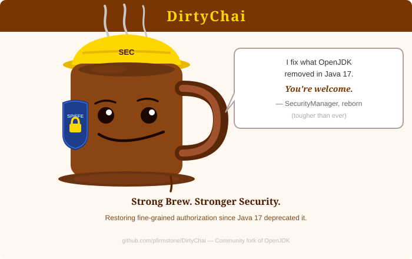

# Part 1 — Overview: Why Fork Both Apache River and OpenJDK?

*This is the first post in a six-part series on JGDMS and DirtyChai.
The series index is at the bottom of this post.*

---

Java's security infrastructure — the `SecurityManager`, `AccessController`, and `ProtectionDomain`
APIs that let a JVM enforce what loaded code is and isn't allowed to do — was deprecated in Java 17
and removed entirely in Java 24. The timing matters: Java 17 was a long-term support release
targeted by almost every enterprise migration plan written in 2021–2022. By the time most
organisations finished moving to it, the APIs they depended on were already scheduled for deletion.
Java 24 delivered on that promise. The result is a JVM that can no longer restrict the actions of
code it loads from a remote source.

That removal is the inciting event for Dirty Chai, but existential for both projects described here.  This may have proven fortuitous, since it triggered a rethink of the whole security archicture, where previously JGDMS remained within the limitations of standard platform API's.

A second thread runs through this story: the service-discovery model. gRPC and REST service meshes
are address-based — you call a URL. Jini (the protocol that Apache River implements) is
*capability-based*: services publish what they can do; clients discover them by interface type on an
IPv6 network, with no hard-wired addresses. Add lease-based registration that cleans up crashed
services automatically, and you have a model that is genuinely different from anything in the modern
microservices toolbox. JGDMS exists because nobody maintained that model to the standard modern
security demands.

---

## The Two Projects

| Project | What it is | Why it exists |
|---|---|---|
| **JGDMS** | A security-hardened fork of [Apache River](https://river.apache.org/) (née Jini) | Provides secure, dynamically-discoverable microservices for the JVM |
| **DirtyChai** | A community fork of OpenJDK | Restores and extends Java's authorization APIs (removed in Java 24); adds `SecurityManager` support for virtual threads; required to run JGDMS |

The two projects are complementary forks of *different* upstreams. JGDMS forks Apache River;
DirtyChai forks OpenJDK. They are designed to be used together.

### Scalability in One Sentence

> **DirtyChai scales vertically. JGDMS scales horizontally.**

DirtyChai unlocks vertical scale: virtual threads with `SecurityManager` enabled (a combination
OpenJDK never achieved), a lock-free policy provider with less than 1% authorization overhead, and
SPIFFE-managed short-lived credentials that rotate without JVM restarts.

JGDMS unlocks horizontal scale: stateless analysis engines that self-register and are automatically
load-balanced, replicated Lookup Services, lease-based cleanup that requires no manual intervention,
and a Verdict Registry keyed by content hash rather than URL so the same JAR is analyzed once
regardless of how many services serve it.

The two properties reinforce each other: a single secure node is DirtyChai's story; a fleet of those
nodes that self-assembles, self-heals, and self-authorizes is JGDMS's story.

---

## What Is JGDMS?

**JGDMS** (*Jini Global Distributed Micro Services*) is described in its own project descriptor as:

> *"Infrastructure for providing secured micro services, that are dynamically discoverable and
> searchable over IPv6 networks."*

Where RPC frameworks stop at "call a remote method," JGDMS goes further: services announce
themselves on IPv6 networks, clients discover them by capability rather than by hard-wired address,
and trust is established cryptographically before any code runs. Three pillars shape every design
decision:

1. **Jini-model service discovery** — lease-based registrations, multicast and unicast lookup,
   event-driven service notifications.
2. **JERI (Jini Extensible Remote Invocation)** — a pluggable, constraint-based RPC layer that
   supersedes standard Java RMI with pluggable transport, per-method security requirements, and
   authenticated dispatch.
3. **Defence-in-depth security** — hardened deserialization, TLSv1.3 transport, Java authorization,
   proxy trust verification, and a novel codebase safety pipeline that analyzes third-party
   bytecode before it is ever loaded.

---

## What Is DirtyChai?

**DirtyChai** is a community fork of OpenJDK that restores, improves, and extends Java's
authorization infrastructure — the `SecurityManager`, `AccessController`, and `ProtectionDomain`
APIs that OpenJDK deprecated in Java 17 and removed entirely in Java 24.

Without these APIs you cannot restrict what code from a particular source can do once it is loaded.
DirtyChai's goal is not to safely run *untrusted* code (it is not a sandbox) but to ensure that
*trusted but independent* parties operate only within their declared and granted privileges. Its key
design goals are:

- Prevent loading of untrusted code (`LoadClassPermission`)
- Break deserialization gadget attack chains (`SerialObjectPermission`)
- Block native code injection (`NativeInvocationPermission`, `NativeMemoryPermission`)
- Maintain and extend permission guard hooks
- High performance and vertical scalability with virtual threads
- Community redesign of the Authorization API for potential inclusion in OpenJDK mainline
- `SpiffeX509TrustManager` and `SpiffeX509KeyManager` — SPIFFE/SPIRE zero-touch certificate management

DirtyChai is required to run JGDMS.



---

## What JGDMS Is Not

JGDMS is **not** a sandbox for running untrusted code. It will not safely isolate malicious
bytecode. Its goal is the opposite: prevent untrusted code from ever being loaded, using
`LoadClassPermission` as the primary gate and SCAP (the Safe Codebase Audit Pipeline, described in
Part 2) as the pre-analysis pipeline. If you need to run code you don't trust, you need a different
tool.

JGDMS **requires DirtyChai** at runtime. Running on bare OpenJDK is not supported: on standard
OpenJDK ≤ 23, virtual threads are assigned an `AccessControlContext` with no permissions when
`SecurityManager` is enabled, which prevents their use in a security context. On OpenJDK 24+, the
`SecurityManager` API was removed entirely. DirtyChai is the only supported runtime JDK.

JGDMS is, however, **compile-time compatible with standard OpenJDK**: you can build JGDMS and your
application code using any standard OpenJDK toolchain. DirtyChai is binary compatible with software
compiled on OpenJDK — no recompilation is required when switching the runtime.

---

## Quick Start: A Minimal JGDMS Deployment

The fastest path to a running JGDMS service is a `ServiceStarter` configuration that specifies
which services to launch, which endpoint to export, and what method constraints to enforce.

### Step 1 — Define the service interface

```java
// HelloService.java — the remote interface
public interface HelloService extends Remote {
    String greet(String name) throws RemoteException;
}
```

The per-method security requirements are **not** written in Java. In JGDMS a method's
constraints are a *configuration* concern — they are declared in the service's configuration file
(Step 2) and applied by the exporter the `Configuration` builds. Keeping them out of the code lets
an operator tighten or relax the wire requirements without recompiling the service.

### Step 2 — Write the ServiceStarter configuration

```
// hello-service.config — Jini configuration file
import net.jini.jeri.*;
import net.jini.jeri.ssl.*;
import net.jini.constraint.*;
import net.jini.core.constraint.*;

org.apache.river.start {
    serviceDescriptors = new ServiceDescriptor[] {
        new NonActivatableServiceDescriptor(
            "http://host.example.org:8080/hello-service-dl.jar", // export codebase — proxy JAR, served over the network
            "hello-service.policy",                 // service security policy file
            "file:hello-service-impl.jar",          // import codebase — impl JAR, loaded locally by the server JVM
            "net.example.HelloServiceImpl",         // implementation class
            new String[]{ "hello-service.config" }  // configuration passed to service
        )
    };
}

net.example.HelloServiceImpl {
    // Per-method security requirements — the configuration concern from Step 1.
    serverExporter = new BasicJeriExporter(
        SslServerEndpoint.getInstance(0),               // TLS on a random port
        new BasicILFactory(
            new BasicMethodConstraints(                 // apply to every method
                new InvocationConstraints(
                    new InvocationConstraint[] {
                        ServerAuthentication.YES,       // server presents a valid certificate
                        ClientAuthentication.YES,       // client must authenticate
                        Confidentiality.YES,            // TLSv1.3 encryption
                        Integrity.YES,                  // MAC-covered
                        AtomicInputValidation.YES       // hardened deserialization of arguments
                    },
                    null)),                             // no preferred-only constraints
            null));                                     // server permission class (null = none)
}
```

The two codebases play different roles. The **export codebase** is the *proxy* codebase — the
classes a remote client downloads to talk to the service — so it must be reachable over the network
(served by an HTTP class server); a `file:` URL is visible only to the local JVM and a client could
never fetch it. The **import codebase** is the server's own implementation classpath, loaded
locally, so `file:` is correct there. For content-verified proxy codebases, JGDMS serves them over
`httpmd:` (the SHA-256-in-the-URL scheme covered in Parts 2 and 4).

### Step 3 — Launch

```sh
# lib/ is the JGDMS distribution's lib directory. The launcher needs the whole runtime
# (service-starter, platform, lib, jeri, rmi-tls, …), so put every jar there on the classpath.
java -Djava.security.policy=start-service.policy \
     -cp "lib/*" \
     org.apache.river.start.ServiceStarter \
     hello-service.config
```

The service self-registers with the Jini Lookup Service at `lookup.example.org:4160`. Any client
that discovers the lookup service can find `HelloService` by interface type — no hard-wired
addresses, no service registry configuration.

---

## Series Index

| # | Title | Depends on |
|---|---|---|
| **1** | **Overview: why fork both Apache River and OpenJDK?** *(this post)* | — |
| 2 | [SCAP: auditing JARs before they are loaded](blog-post-2-scap.md) | — (standalone) |
| 3a | [The identity model: three principals on every dispatch thread](blog-post-3a-identity-model.md) | 1 |
| 3b | [Multi-Subject dispatch and distributed transaction authorization](blog-post-3b-multi-subject.md) | 3a |
| 4 | [Authorization without a single point of trust](blog-post-4-authorization.md) | 2, 3a |
| 5 | [Virtual threads, lock-free policy, and why security does not have to be slow](blog-post-5-performance.md) | 1–4 |

---

*GitHub repositories:*
- *JGDMS: <https://github.com/pfirmstone/JGDMS>*
- *DirtyChai: <https://github.com/pfirmstone/DirtyChai>*
