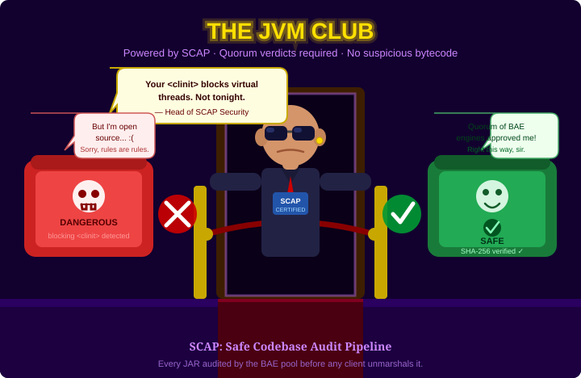

# Part 2 — SCAP: Auditing JARs Before They Are Loaded

*This is the second post in a six-part series on JGDMS and DirtyChai.
It stands alone — no prior reading required.
The series index is at the bottom of this post.*

---

Imagine a supply chain attack that passes every static scanner. The malicious JAR does not contain
known malware signatures. Its dependencies are clean. Its CVE score is zero. What it *does* contain
is a class initializer (`<clinit>`) that opens a network socket — not at method call time, but the
moment the JVM first touches the class during deserialization. On a virtual-thread server handling
thousands of concurrent requests, that single blocking `<clinit>` parks the carrier thread. A few
dozen such simultaneous deserializations pin all available carrier threads. The JVM scheduler stalls
completely. The service is dead, and the attacker never had to exploit a vulnerability in the
traditional sense.

Static analysis at build time cannot catch this reliably: it requires knowledge of the *runtime*
context — which classes are reachable from `<clinit>`, which of those perform blocking I/O, and
whether any `SocketPermission` grant covers that call. SCAP's answer is to audit the JAR at
runtime, before the first deserialization, with a quorum of isolated analysis engines. Here is how
it works.

---

## Why This Matters

A distributed Java system that loads remote code is exposed to supply-chain attacks: an attacker
replaces a legitimate JAR with one containing malicious or denial-of-service bytecode. Blocking
class initializers (`<clinit>`) are a particularly subtle liveness attack: they can pin virtual
thread carrier threads or hold the JVM class-loading lock, causing complete scheduler stalls with
as few concurrent requests as `Runtime.availableProcessors()`.

Code repositories assembled prior to runtime are also subject to library vulnerabilities and
transient dependency vulnerabilities.



---

## The Five Hosts

SCAP is a five-host architecture. Each host has a precisely scoped role, and the isolation
*between* hosts is as important as the analysis *within* them.

```
┌──────────────────────────────────────────────────────────────────────────────┐
│                  Safe Codebase Audit Pipeline (SCAP)                         │
│                                                                              │
│  Host 1 — Jini Lookup Service                                                │
│    Stores marshalled service items opaquely.                                 │
│    Fires events when new services register.           ◄──── clients query    │
│           │                                                                  │
│           │ new service registered (event)                                   │
│           ▼                                                                  │
│  Host 4 — Codebase Downloader  ◄── ONLY component with outbound internet     │
│    Downloads JARs proactively on new service registrations.                  │
│           │                                                                  │
│           │ AnalysisRequest (JAR bytes + SHA-256)                            │
│           ▼                                                                  │
│  Host 2 — BAE Pool  (SELinux-isolated, stateless, replicated N×)             │
│    Analyzes JAR bytecode with ASM visitors.                                  │
│    Signs JarAnalysisReport with its own private key.                         │
│    No outbound internet. No exec. No JNI. No FFM.                            │
│    Abnormal exit → CrashReport condemns the codebase.                        │
│           │                                                                  │
│           │ signed JarAnalysisReport   (NO direct path from Host 2→Host 3    │
│           │ goes via Host 4 / client)  ← this isolation is intentional       │
│           ▼                                                                  │
│  Host 3 — Verdict Registry  ◄──────────────────── clients query before       │
│    Accumulates signed reports.                         unmarshalling proxy   │
│    Issues RegistryVerdict (SAFE / DANGEROUS / INCONCLUSIVE)                  │
│    only when a quorum of independent BAE engines agrees.                     │
│                                                                              │
│  Host 5 — JFR Telemetry Service  (reactive, NO connection to Hosts 2/4)      │
│    Receives VirtualThreadPinned JFR events from client JVMs.                 │
│    Triggers re-analysis without letting clients influence verdicts directly. │
└──────────────────────────────────────────────────────────────────────────────┘

Key isolation invariants:
  Host 2 → Host 3: NO direct connection  (compromised BAE cannot write verdicts)
  Host 4 ↔ Host 5: NO connection         (JFR flood cannot DoS analysis pipeline)
  Clients never interact with Host 2 or Host 4 directly
```

The most important invariant is the gap between Host 2 and Host 3. A Bytecode Analysis Engine
(BAE) that can write directly to the Verdict Registry is game over: a compromised engine could
mark a dangerous JAR as `SAFE`, and no downstream component would know. By routing analysis
reports *through Host 4 or the client* before they reach the registry, SCAP ensures that a
compromised BAE instance can only produce a report that the registry will reject (it will not have
a quorum of corroborating signatures). The architectural complexity of this routing is the price of
that guarantee — and it is worth paying.

Two further invariants:
- Host 4 (Codebase Downloader) and Host 5 (JFR Telemetry) have no connection to each other. A
  flood of `VirtualThreadPinned` JFR events from a misbehaving client cannot reach the download
  or analysis pipeline.
- An abnormal JVM exit (Phoenix crash) on Host 2 is itself treated as a security signal: Phoenix
  submits a `CrashReport` directly to the Verdict Registry, condemning the codebase that caused
  the crash.

> **See also:** [Diagram 1 — SCAP five-host pipeline](<Big picture security architecture/diagram1_scap_five_hosts.svg>)

---

## The Bytecode Analysis Engine

The BAE uses [ASM](https://asm.ow2.io/)-based visitors to analyze every class in a JAR:

- **`ClinitBlockingVisitor`** — BFS traversal from `<clinit>` to a registry of blocking sinks
  (network I/O, file locks, thread creation, native calls). Classifies risk as `CLEAN`,
  `BLOCKING_GUARDED`, or `BLOCKING_DECLARED` (DANGEROUS). This is the visitor that catches the
  attack described in the introduction.
- **`AtomicSerialComplianceVisitor`** — verifies that every `Serializable` class crossing a JERI
  wire follows the `@AtomicSerial` protocol. Violations produce a `DANGEROUS` verdict.
- **Cyclic `<clinit>` detector** — detects circular class-initializer dependency chains that would
  deadlock JVM class loading.
- **`PERMISSIONS.LIST` integration** — reads each JAR's declared permissions and upgrades
  `BLOCKING_GUARDED` to `BLOCKING_DECLARED` when the JAR already requests the permission that
  guards a blocking sink.

The analysis result is a signed `JarAnalysisReport` — signed by the engine's own private key. The
Verdict Registry verifies this signature before accepting the report. No client trusts the BAE
directly; they trust only the Verdict Registry's quorum-based `RegistryVerdict`.

The BAE pool is **stateless**: an `AnalysisRequest` is self-contained (JAR bytes + SHA-256 hash).
Any engine instance can process any request. Adding analysis capacity means starting additional BAE
instances; they self-register and are automatically load-balanced via Jini service discovery.

---

## Client-Side Verdict Cache

`PreferredProxyCodebaseProvider` maintains a `ConcurrentHashMap` verdict cache keyed by SHA-256
JAR hash. Behaviour:

- A successful `SAFE` verdict from the Verdict Registry is cached immediately.
- If the Verdict Registry is unreachable on a subsequent request, the cached entry is used if its
  age is within the configured TTL.
- TTL is controlled by the system property `jgdms.proxy.verdictCacheTtlMs` (default `300000` —
  5 minutes). Set to `0` to disable the cache entirely.

The cache provides resilience against transient Verdict Registry outages without weakening the
security guarantee: only verdicts that were previously confirmed `SAFE` are served from the cache.
The Verdict Registry is keyed by SHA-256 content hash, not URL — the same JAR served from
different URLs is analyzed once and the result cached forever. URL changes, CDN migrations, and
service moves do not invalidate existing verdicts.

---

## JAR Download Hardening

`PreferredProxyCodebaseProvider` applies the following limits to outbound JAR fetches, defending
against oversized or slow-drip responses:

| Property | Default | Effect |
|---|---|---|
| `jgdms.proxy.jarReadTimeoutMs` | `30000` (30 s) | Connect + read timeout per JAR |
| `jgdms.proxy.maxJarBytes` | `536870912` (512 MiB) | Per-JAR byte limit; fetch aborted on breach |
| `jgdms.proxy.maxCodebaseJars` | `100` | Maximum JARs per codebase annotation |

`validateDigestOffsets()` is called before `extractJarDigest` to ensure the declared byte-offset
array is well-formed, preventing crafted `getDigestOffsets()` responses from causing
out-of-bounds reads.

---

## Where SCAP Fits in the Larger Picture

SCAP operates at the *pipeline* level — it catches dangerous JARs before they are loaded. Part 4
of this series describes the *policy* level: `DigestGrant` conditions a permission grant on the
SHA-256 content hash of the JAR, so even a JAR that somehow bypassed SCAP cannot acquire
permissions unless its hash matches a policy entry. The two layers are complementary: SCAP is the
fast pre-filter; `DigestGrant` is the catch-all policy backstop.

---

## Series Index

| # | Title | Depends on |
|---|---|---|
| 1 | [Overview: why fork both Apache River and OpenJDK?](blog-post-1-why-fork.md) | — |
| **2** | **SCAP: auditing JARs before they are loaded** *(this post)* | — (standalone) |
| 3a | [The identity model: three principals on every dispatch thread](blog-post-3a-identity-model.md) | 1 |
| 3b | [Multi-Subject dispatch and distributed transaction authorization](blog-post-3b-multi-subject.md) | 3a |
| 4 | [Authorization without a single point of trust](blog-post-4-authorization.md) | 2, 3a |
| 5 | [Virtual threads, lock-free policy, and why security does not have to be slow](blog-post-5-performance.md) | 1–4 |

---

*GitHub repositories:*
- *JGDMS: <https://github.com/pfirmstone/JGDMS>*
- *DirtyChai: <https://github.com/pfirmstone/DirtyChai>*
