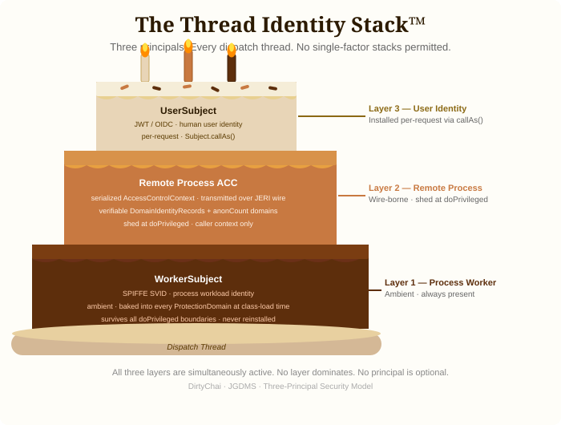

# Part 3a — The Identity Model: Three Principals on Every Dispatch Thread

*This is the third post (part a) in a six-part series on JGDMS and DirtyChai.
Recommended prerequisite: [Part 1](blog-post-1-why-fork.md).*
*Part 3b continues with multi-Subject dispatch and distributed transactions.*
*The series index is at the bottom of this post.*

---

Most web frameworks have one identity per request. A servlet container binds a `Principal` to a
thread at the start of a request and clears it at the end. A gRPC server reads a credential from
the channel metadata and exposes it to interceptors. The model is simple: one caller, one identity,
one authorization check.

JGDMS — running on DirtyChai — has three simultaneously active identities on every dispatch thread.
Each has a different carrier, a different lifetime, and a different revocation path. Understanding
this model is the key to understanding how authorization in JGDMS actually works.

---

## SPIFFE/SPIRE: Zero-Touch Certificate Management

Before diving into the identity model itself, it is worth understanding how *process* identities
are issued and managed, because that foundation shapes everything above it.

In a fleet of services, long-lived keystores are a management and security liability. JGDMS and
DirtyChai integrate [SPIFFE](https://spiffe.io/) workload identity via SPIRE. Each host process and
client JVM receives a short-lived (~1 hour) X.509 SVID (SPIFFE Verifiable Identity Document) from
a local SPIRE agent.

The `SpiffeCredentialManager` component:
- Opens the SPIRE Workload API socket on startup
- Populates an in-memory `Subject` with the current X.509 certificate and private key (no
  filesystem keystore)
- Rotates credentials automatically when the SVID nears expiry
- Triggers policy refresh on each rotation

No `keytool`, no PKCS#12 files, no manual certificate renewal. Each service's identity is managed
by the SPIRE control plane — revocation and rotation happen without JVM restarts. SPIFFE IDs are
human-readable: `spiffe://jgdms.example.org/host/bae/engine-2` immediately tells an operator which
component this identity belongs to.

---

## The Sealed Subject Hierarchy

DirtyChai introduces a sealed `Subject` hierarchy with three distinct identity layers:

```
┌─────────────────────────────────────────────────────────────────────┐
│                    DirtyChai Subject Hierarchy                      │
│                                                                     │
│  Subject (vanilla, legacy)                                          │
│   ├── WorkerSubject  (sealed, permits SpiffeSubject, RemoteSubject) │
│   │     • Process workload identity (SPIFFE SVID)                   │
│   │     • Baked into every ProtectionDomain at class-load time      │
│   │     • AMBIENT — survives all doPrivileged boundaries            │
│   │     • Never passed to callAs() or doAs() — illegal              │
│   │                                                                 │
│   └── UserSubject  (final)                                          │
│         • Human user identity (JWT/OIDC)                            │
│         • Carried in SCOPED_SUBJECT ScopedValue<Subject[]>          │
│         • Installed per-request via Subject.callAs(...)             │
│         • Injected into ProtectionDomain array by AccessController  │
└─────────────────────────────────────────────────────────────────────┘

┌─────────────────────────────────────────────────────────────────────┐
│               Three Identity Layers on a Dispatch Thread            │
│                                                                     │
│  Layer 1 — Process Worker  (WorkerSubject, ambient)                 │
│    RFC3986URLClassLoader / PreferredClassLoader inject the          │
│    server's Principal[]; DirtyChai SecureClassLoader injects the    │
│    client's Principal[] + DigestCodeSource at class-load time.      │
│    Always present at every checkPermission. Never reinstalled.      │
│                                                                     │
│  Layer 2 — Remote Process  (serialized ACC ProtectionDomains)       │
│    Remote client's WorkerSubject principals travel inside a         │
│    serialized AccessControlContext over the JERI wire.              │
│    Unverifiable domains are encoded as anonCount; the receiver      │
│    reconstructs anonymous placeholder domains. Shed at doPrivileged.│
│                                                                     │
│  Layer 3 — User  (UserSubject via callAs)                           │
│    Per-request human identity bound by JERI dispatcher via          │
│    Subject.callAs(userSubject, () -> invoke(...)).                  │
│    AccessController.getContext() bakes user principals directly     │
│    into the ProtectionDomain array. Survives doPrivileged.          │
└─────────────────────────────────────────────────────────────────────┘
```



---

## Layer 1 — WorkerSubject: The Ambient Process Identity

`WorkerSubject` represents the JVM process itself. With SPIFFE/SPIRE, DirtyChai's
`SpiffeCredentialManager` constructs a sealed `SpiffeSubject extends WorkerSubject` and bakes it
into every `ProtectionDomain` at class-load time. This Subject contains:

- A `SpiffePrincipal` derived from the SVID URI SAN (e.g.
  `spiffe://jgdms.example.org/host/bae/engine-2`)
- An `X500Principal` derived from the certificate Subject DN
- The short-lived X.509 credential (certificate chain + private key) — never written to disk

The key property of `WorkerSubject` is that it is **ambient**: present in every `ProtectionDomain`
regardless of `doPrivileged` nesting. A servlet container's `Principal` would be cleared or
shadowed by a `doPrivileged` call — the ambient identity would be gone for the duration of that
block. The `WorkerSubject` is not installed via `callAs` or `doAs`; it is injected at class-load
time and is therefore visible at every `AccessController.checkPermission()` call throughout the
life of the JVM. The server never needs to reinstall it per request.

This distinction matters for authorization: a policy grant conditioned on a `SpiffePrincipal`
cannot be bypassed by wrapping a block in `doPrivileged`. The workload identity is structural, not
contextual.

---

## Layer 2 — Remote Process Identity

The remote client's `WorkerSubject` principals travel differently: they are carried inside a
serialized `AccessControlContext` transmitted over the JERI wire.

`AccessControlContextSerializer` encodes `ProtectionDomain`s for transport:

- **Verifiable domains** (`httpmd:` URL or `DigestCodeSource`): encoded as `DomainIdentityRecord`
  with their SHA-256-verifiable identity. The receiving JVM checks the digest before accepting
  the domain.
- **Unverifiable domains**: counted as `anonCount` (a 16-bit unsigned integer). The receiving JVM
  reconstructs anonymous placeholder `ProtectionDomain`s — their permission ceilings are preserved
  without asserting a specific identity.
- `jrt:/java.base` domains are excluded from `anonCount`; other `jrt:` module domains are retained.

Wire layout: `[httpmdCount: 4B BE][DomainIdentityRecord…][anonCount: 4B BE]`

These remote domains are shed at `doPrivileged` boundaries — they represent the *caller's* context,
not the server's. No session state, no thread-local leakage between calls, no boilerplate in service
code.

This is the *code/privilege boundary* axis, and DirtyChai keeps it deliberately separate from *who*
the call is for: the user identity (Part 3b) rides a `ScopedValue` and **survives** `doPrivileged`,
whereas these caller domains are shed by it. That separation is exactly why DirtyChai is retiring the
old `Subject.doAs(...)`, which fused identity with the boundary in a single call — `callAs` handles
*who*, `doPrivileged` handles the *boundary*. Parts 3b and 4 pick this up.

---

## ProtectionDomain Principal Injection

JGDMS and DirtyChai, have two complementary injection paths combine to populate every proxy `ProtectionDomain`
with the full trust context:

| Class | What it injects | How |
|---|---|---|
| JGDMS `RFC3986URLClassLoader` (5-arg) / `PreferredClassLoader` (7-arg) | Server's `Principal[]` | `final` field passed at construction; injected into each `ProtectionDomain` at `defineClass` time |
| DirtyChai `SecureClassLoader` | Client's process `Principal[]` + `DigestCodeSource` (codebase SHA-256) | Called by the JDK's class-loading machinery at class-load time |

The combined result is a `ProtectionDomain` that carries both sides of the call and the codebase
content hash, so a policy grant can simultaneously scope on the server's SPIFFE workload, the
client's SPIFFE workload, and the exact JAR content — no single axis alone is sufficient.

---

## BootstrapPermission and LocalPrincipalProvider

During the boot window — before the `VerdictRegistry` is reachable — codebase loading is gated by
`BootstrapPermission` (`net.jini.loader.pref`, target `"loadCodebase"`). Only callers whose
`ProtectionDomain` holds this permission (i.e. code already trusted by the bootstrap policy) can
trigger a SPIFFE-principal-based codebase load before the registry is online.

`LocalPrincipalProvider` is a SPI in `org.apache.river.api.security` that bridges `jgdms-platform`
and `jgdms-jeri`. `SpiffeCredentialManager.start()` registers the managed `Subject` via
`Security.registerLocalPrincipalProvider()`. When `Security.currentPrincipals()` is called outside
a `callAs` scope (e.g. during bootstrapping or on a plain thread), it falls back to the registered
provider to retrieve the local SPIFFE principals rather than returning an empty set.

---

## What Part 3b Covers

Part 3a has described the first two layers of identity (the process `WorkerSubject` and the remote
process identity serialized in the ACC). The third layer — `UserSubject` carrying a human user's
JWT/OIDC identity, the wire protocol that transmits up to 16 such Subjects per call, and how
`SettleTransactionPermission` extends this model to distributed transactions — is covered in
[Part 3b](blog-post-3b-multi-subject.md).

---

## Series Index

| # | Title | Depends on |
|---|---|---|
| 1 | [Overview: why fork both Apache River and OpenJDK?](blog-post-1-why-fork.md) | — |
| 2 | [SCAP: auditing JARs before they are loaded](blog-post-2-scap.md) | — (standalone) |
| **3a** | **The identity model: three principals on every dispatch thread** *(this post)* | 1 |
| 3b | [Multi-Subject dispatch and distributed transaction authorization](blog-post-3b-multi-subject.md) | 3a |
| 4 | [Authorization without a single point of trust](blog-post-4-authorization.md) | 2, 3a |
| 5 | [Virtual threads, lock-free policy, and why security does not have to be slow](blog-post-5-performance.md) | 1–4 |

---

*GitHub repositories:*
- *JGDMS: <https://github.com/pfirmstone/JGDMS>*
- *DirtyChai: <https://github.com/pfirmstone/DirtyChai>*
