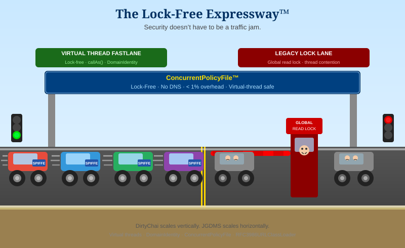

# Part 5 — Virtual Threads, Lock-Free Policy, and Why Security Does Not Have to Be Slow

*This is the fifth and final post in a six-part series on JGDMS and DirtyChai.
Recommended prerequisite: the full series (Parts 1–4).*
*The series index is at the bottom of this post.*

---

Security and performance are usually presented as a trade-off. Enable a `SecurityManager` and
permission checks add overhead. Maintain per-thread identity contexts and you impose synchronization
costs. Rotate credentials frequently and you introduce periodic latency spikes. Accept all of these
and you end up with a security model that nobody enables in production because it cannot survive a
load test.

This post describes how DirtyChai and JGDMS break that trade-off — not by ignoring it, but by
designing the infrastructure so that the security properties described in Parts 1–4 *reinforce*
performance rather than undermining it.

---

## Virtual Thread Support: The DomainIdentity Problem

OpenJDK's virtual thread implementation (Project Loom) had a subtle interaction with the
`SecurityManager` infrastructure: virtual threads were allocated an `AccessControlContext` with
**no permissions** when `SecurityManager` was enabled. The result was that virtual threads were
effectively non-functional in a security context on standard OpenJDK ≤ 23. On OpenJDK 24+, the
`SecurityManager` was removed entirely, closing the option for any fix in the upstream.

The root cause was a performance optimization in how `AccessControlContext` instances are created
and combined. Each time a virtual thread was parked and unparked, the ACC had to be reconstructed.
The standard JDK did not cache immutable ACC instances — it recreated them — and the `ProtectionDomain`
comparison relied on object identity (`==`), not value equality. Two `ProtectionDomain` instances
representing the same conceptual domain were treated as distinct, causing the combined ACC to grow
unboundedly and the permission ceiling to drop.

DirtyChai's fix has two parts:

1. **`DomainIdentity`** — a `ProtectionDomain` subclass that implements `equals` and `hashCode`
   based on the domain's content (principals, codebase, permissions) rather than object identity.
   Without this, `SubjectDomainCombiner` produces duplicate domains on every thread
   park/unpark cycle: two domains that represent the same principal set but are different objects
   are treated as distinct ceiling constraints, and the intersection of an ever-growing set of
   duplicate ceilings eventually drops to the empty set. With `DomainIdentity`, duplicates are
   eliminated, the ACC stays compact, and permission checks remain correct across park/unpark
   boundaries.

2. **Immutable ACC caching** — DirtyChai caches immutable `AccessControlContext` instances rather
   than recreating them on every virtual thread context switch. This minimizes ACC object creation,
   reduces GC pressure, and makes virtual thread scheduling measurably faster under load.

### The Security Enhancement

Beyond correctness, this is also a significant **security enhancement**. Each virtual thread carries
its own immutable, isolated `AccessControlContext`, so security context (authenticated principals,
protection domains, granted permissions) is independently maintained per thread. Even when virtual
threads share a carrier platform thread, their security contexts remain fully isolated — one request
cannot inadvertently inherit or use the security context of a concurrent request.
`SubjectDomainCombiner` attaches the authenticated Subject's principals to every non-static
`ProtectionDomain` in the virtual thread's ACC (static, all-permission privileged domains are left
unchanged), so every `AccessController.checkPermission()` call is evaluated against
the correct user's identity. This enables millions of concurrent virtual threads — each running
under a different authenticated Subject — to receive correct, per-principal authorization decisions
without shared mutable state.

SCAP's `ClinitBlockingVisitor` (described in Part 2) is the complementary piece: it ensures that
JAR files containing blocking class initializers (the main carrier-thread pin risk) are flagged
before they are ever loaded, enabling confident use of virtual threads at scale.

---

## Lock-Free `ConcurrentPolicyFile`

The standard Java policy file implementation uses a global read lock on every permission check.
Under high concurrency — thousands of virtual threads each making dozens of permission checks per
request — that lock becomes a bottleneck that grows with the number of threads, not with the
number of distinct callers.

DirtyChai's `ConcurrentPolicyFile` uses RFC 3986 URI matching and a lock-free data structure to
evaluate grants. Key properties:

- **No DNS lookups** — URI matching uses structural comparison, not name resolution. A `host`
  segment in a grant is matched against the URI's authority component, not by resolving it to an
  IP address and comparing.
- **Less than 1% overhead** — authorization decisions do not become a bottleneck under high
  concurrency. Benchmarks show less than 1% overhead on policy checks compared to no policy at all.

The lock-free design also benefits the three-layer policy stack described in Part 4: each of the
three providers (`SpiffePolicyFile`, `RemotePolicyProvider`, `DynamicPolicyProvider`) delegates to
the same lock-free evaluation path, so the per-call cost of the composable stack is the same as
the cost of a single flat policy file.

---

## Faster-than-RMI JERI

JERI (Jini Extensible Remote Invocation) replaces standard Java RMI with a pluggable transport
that is demonstrably faster:

- **Unnecessary DNS calls eliminated** — `RFC3986URLClassLoader` uses URI-based class loading
  without the name-resolution overhead of `URLClassLoader`. Codebase URLs are structural
  identifiers, not names to be resolved.
- **`RFC3986URLClassLoader` significantly faster than `URLClassLoader`** — the combination of
  structural URI matching, no DNS, and `DigestCodeSource` content-hash verification (which
  short-circuits on a cache hit) makes remote class loading faster than the standard alternative.
- **`@AtomicSerial` outperforms standard Java serialization** in benchmarks — the validation-before-
  construction protocol catches errors early and avoids the deferred construction paths that
  standard deserialization takes through `readResolve` and `readObject` chains.

---

## Horizontal Scaling

The performance story extends beyond a single node. JGDMS is designed so that adding nodes
increases capacity without requiring reconfiguration of existing nodes:

- **Stateless BAE pool** — `AnalysisRequest` is self-contained (JAR bytes + SHA-256 hash). Any
  engine instance can process any request. Adding analysis capacity means starting additional BAE
  instances; they self-register with the Jini Lookup Service and are automatically load-balanced.
  No coordinator, no configuration change.
- **Quorum-based verdicts** — adding engines increases both throughput and confidence
  simultaneously. A quorum of three engines provides stronger assurance than one, and twice the
  analysis throughput.
- **Multiple Lookup Services** — services register with multiple groups and clients query multiple
  locators (via `LookupDiscoveryManager`) with merge semantics, so there is no single lookup
  dependency.
  The lookup tier has no single point of failure.
- **Content-addressed Verdict Registry** — keyed by SHA-256 hash, not URL. The same JAR is
  analyzed once regardless of how many services serve it. URL changes and CDN migrations do not
  invalidate verdicts. The analysis pipeline scales with the *number of distinct JARs* in the
  ecosystem, not the number of services.
- **Lease-based resource management** — all service registrations and event subscriptions expire
  unless actively renewed. Departed or crashed services clean themselves from the registry
  automatically. No stale registrations accumulate at scale. The operational burden of managing
  a large fleet does not grow with fleet size.

---

## The Full Picture

The security model described in Parts 1–4 only holds if the platform can run it at scale. An
identity model with three simultaneous principals per thread is worthless if it makes virtual
threads unusable. A content-hash policy that verifies JAR digests on every permission check is
worthless if it serializes all threads through a global lock. A SCAP pipeline with a quorum of
independent analysis engines is worthless if the BAE pool is a bottleneck that limits how many
JARs can be audited per hour.

DirtyChai's fixes to virtual thread support, ACC caching, and `ConcurrentPolicyFile` are not
performance optimizations added on top of a security model. They are the foundation that makes
the security model deployable. Security and performance reinforce each other when the
infrastructure is designed to support both from the start.

> **DirtyChai scales vertically. JGDMS scales horizontally.**

---

## Series Index

| # | Title | Depends on |
|---|---|---|
| 1 | [Overview: why fork both Apache River and OpenJDK?](blog-post-1-why-fork.md) | — |
| 2 | [SCAP: auditing JARs before they are loaded](blog-post-2-scap.md) | — (standalone) |
| 3a | [The identity model: three principals on every dispatch thread](blog-post-3a-identity-model.md) | 1 |
| 3b | [Multi-Subject dispatch and distributed transaction authorization](blog-post-3b-multi-subject.md) | 3a |
| 4 | [Authorization without a single point of trust](blog-post-4-authorization.md) | 2, 3a |
| **5** | **Virtual threads, lock-free policy, and why security does not have to be slow** *(this post)* | 1–4 |

---

*GitHub repositories:*
- *JGDMS: <https://github.com/pfirmstone/JGDMS>*
- *DirtyChai: <https://github.com/pfirmstone/DirtyChai>*
