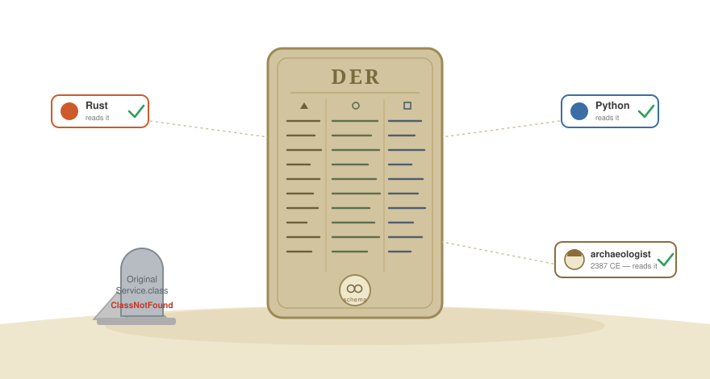

////
AsciiDoc version of Part 6, for Nicolas Frankel's preview branch.
Notes for publication:
  * Prepend the site's front matter (title/date/tags/layout) per the blog template.
  * Internal cross-links (link:blog-post-N[...]) point at the relative draft names;
    remap them to the published part URLs.
  * images/der-rosetta-stone.svg is a DRAFT placeholder cartoon — replace with the
    finished illustration; keep the caption.
  * The [plantuml] block renders via asciidoctor-diagram at build (no pre-rendered SVG needed).
////
= Part 6 — Decoupling Data From Code: DER on the JERI Wire
:source-highlighter: rouge
:icons: font

[.lead]
This post continues the JGDMS and DirtyChai series. It goes one layer beneath
link:blog-post-4-authorization[Part 4], which introduced `@AtomicSerial` as the
deserialization defence, down to the wire format that protocol actually produces.
The series index is at the bottom.

Most serialization frameworks share one unstated assumption, and almost every
problem they have flows from it: the bytes on the wire *are* the object's private
state. Java's built-in serialization makes this explicit — `writeObject` walks an
object's fields and emits them; `readObject` allocates an instance and writes
those fields back in. The marshalled form is a snapshot of a particular class's
internals, and it can only ever be read by that same class.

That assumption is comfortable, and it is the root of three separate failures that
the industry usually treats as unrelated problems with unrelated tooling:

* *Security.* If the bytes are private state, then reading them means
_reconstructing_ an object by setting its fields directly — construct-then-set, by
reflection, before any constructor or invariant runs. That is precisely the
mechanism every Java deserialization gadget chain exploits.
* *Interoperability.* If the bytes are a Java class's internals, only Java code
that has that exact class can read them. Nothing else — no other language, no
archival tool, no future version that lost the class — can make sense of the data.
* *Versioning.* If the data is welded to a class, then "which version of the data"
and "which version of the class" are the same question, and you are forced into a
naming or numbering scheme to keep them apart.

The DER JERI layer in JGDMS is what you get when you refuse the assumption. The
wire form is _not_ the object; it is a self-describing, schema-bearing artifact
that happens to be reconstructable into an object. That single inversion settles
all three problems at once — and the rest of this post is about how, and what it
costs.

.Self-describing. Schema included. Class file not required.

== The contract is authored, not derived

link:blog-post-4-authorization[Part 4] described the `@AtomicSerial` constructor
protocol: a `(GetArg)` constructor whose first act is a static `check(GetArg)` that
validates every value _before_ a field is assigned. The piece that matters for the
wire is the other half of the contract:

[source,java]
----
public static SerialForm[] serialForm();          // the wire shape
public static void serialize(PutArg arg, T obj);   // state out
public T(GetArg arg) throws IOException;            // state in, invariant-enforcing
----

`serialForm()` is the declared wire ABI, and the important word is _declared_. It
is written by the author, not derived from the class's fields. It may match the
fields, and often does — but it does not have to, and the cases where it
deliberately differs are the point. `AbstractLease` puts a `serialFormat` and a
`duration` on the wire while keeping a transient `expiration` in memory; the wire
contract and the implementation have genuinely diverged, on purpose. The moment
you derive the wire form from fields — which is what `Serializable` does — you
re-weld the data to the implementation and you have lost the ability to change one
without the other.

So the first move is simply this: the wire format is a contract a class _honours_,
not a dump of what a class _is_. Fields are private and stay private; no reflective
field access, no `setAccessible`, no `opens`. State leaves through an author-written
`serialize` and returns through an invariant-enforcing constructor. A level with no
wire state declares `@AtomicSerial.Stateless` and is done.

== Package-private access without a backdoor

The authored contract creates an immediate problem. A class's `serialForm`,
`serialize`, and `(GetArg)` constructor should be _package-private_ — they are
implementation, not public API — yet the marshalling engine lives in another
package, and another module, and cannot call package-private members. The two
usual escapes each demolish something the rest of this design is trying to protect:

* *Make them public.* Now the serialization machinery is permanent public surface.
The fields stay private, but the methods that read and rebuild them are exposed and
frozen as API — encapsulation lost by another door.
* *`setAccessible(true)` or `opens`.* Now you have asked the JVM to _suspend an
access check_, or opened the package to deep reflection. That reflective backdoor
is not a neutral convenience: it is the exact capability that deserialization
gadgets and module-boundary escapes depend on. You bought your access by lowering
the wall for everyone.

JGDMS takes neither. The access broker is a `MarshalDelegate`: a *public class
compiled into the same package* as the `@AtomicSerial` classes it serves. Being a
genuine package-mate — same runtime package, `(package name, defining loader)` — it
has ordinary, language-level package-private access to its neighbours, and it
dispatches by *direct calls* (`Foo.serialForm()`, `new Foo(arg)`), no reflection
anywhere. The engine never touches a private member; it speaks only to the
delegate, and only through the narrow public `MarshalDelegate` interface. Nothing
is made public, nothing is opened, `setAccessible` is never called. The wall stays
up; one small, intentional door is built _inside_ the package by something already
entitled to be there.

What keeps this from becoming per-package boilerplate is that the delegate is
*generated*. An annotation processor keyed on `@AtomicSerial` emits the per-package
delegate and its registration at compile time — and it generates only the
_dispatch_, the forwarding to each class's authored `serialForm` / `serialize` /
`(GetArg)`. It never generates the contract — that needs human judgement — and
never any field access, which is the thing being refused in the first place. The
part that requires a person stays authored; the part that is pure mechanism is
machine-written, identically every time. (When no delegate can serve a non-public
member, that is a compile-time error pointing at the gap — not a silent fall back
to `setAccessible`.)

`setAccessible` asks the JVM to _pretend_ a barrier isn't there; the delegate never
needs the pretence, because it genuinely has the right. That is the whole
difference between a backdoor and a door — and removing the _need_ for the backdoor
is what removes the surface the attacks were aiming at.

== Why DER, a standard from the 1980s

Given an authored contract, you still need an encoding for it, and JGDMS chose
DER — the Distinguished Encoding Rules from ASN.1, specified in ITU-T X.690. It is
older than Java, and it is the backbone of the PKI that every TLS handshake and
X.509 certificate already depends on. Reaching for it instead of inventing a new
format is the most boring decision in the design, and the most defensible.

Two properties earn it the job.

*It is deterministic.* DER is _canonical_: a given logical value has exactly one
valid byte encoding. This sounds like a pedantic detail and is in fact load-bearing
for everything built on top. JGDMS turns each level's `serialForm()` into an
`AtomicSerialSchemaRecord` and chains them with SHA-256 into a `SchemaChain` — a
Merkle structure whose leaf `schemaDigest` commits the whole type hierarchy. That
digest is only meaningful if the encoding is canonical: if the same shape could
encode two ways, it would hash two ways, and the digest would identify nothing. The
same property is what lets a wire form be _signed_ and verified bit-for-bit. This is
the same content-addressing principle as link:blog-post-4-authorization[Part 4]'s
`DigestGrant` — trust a thing by what it _is_, the hash of its bytes, not by what it
is _called_ — now applied to the data schema itself. Non-canonical formats, Java's
own serialization included, cannot carry that weight.

*It is well-proven.* Choosing DER means inheriting a formal specification that fixes
exactly what the bytes mean — there is no JGDMS-specific ambiguity to argue about —
and a decoder ecosystem that already exists in every language because PKI runs on
it. The polyglot claim later in this post is not aspirational for that reason: the
readers are already out there.

One honest caveat, because it is the reason the codec work is real work and not
"just use a library": ASN.1/DER _parsers_ have their own long history of bugs. The
ambiguity DER removes on the encoding side still has to be met by a disciplined
decoder on the reading side. Standing on the shoulders of giants means inheriting
their rigour deliberately, not assuming it arrives for free.

== The schema travels with the data

Because the schema is a first-class, separable artifact, it can be carried _with_
the payload instead of being implied by a class you must already possess. This is
the difference between two types that look interchangeable and are not.

`java.rmi.MarshalledObject` is the old way: opaque, JOSS-encoded bytes plus a
codebase annotation. To read it you need the class. `net.jini.io.MarshalledInstance`
— specifically its DER form, `AtomicMarshalledInstance` — carries `payloadBytes`, a
`codebaseAnnotation`, *and* `schemaBytes` / `schemaDigest`. The data describes
itself.

A recent and unglamorous piece of work in JGDMS was migrating every fresh-marshal
site across the service layer from the former to the latter — lease renewal
handbacks, mailbox event logs, discovered-registrar tables, lookup attributes,
activation cookies. Each `convertToMarshalledObject()` call was a quiet point where
the schema got dropped and the data collapsed back into an opaque, code-bound blob.
None of it was visible in a demo; all of it mattered for the property this post is
about. Closing those sites keeps the decoupling intact end-to-end instead of leaking
it back at the edges — which is exactly the failure mode you do not notice until a
non-Java consumer, or a future archaeologist with the data but not the code, actually
needs to read the bytes.

That gives two things most serialization cannot:

* *Polyglot.* A reader in another language can decode the payload against the carried
schema, in a format it already understands, without the Java class.
* *Archaeology.* The data outlives the code. Recover a payload years later, with the
originating classes long gone, and the schema still tells you what the bytes mean.

== Each level keeps its own domain — and its own namespace

Here is the part that is genuinely hard to retrofit, which is probably why nothing
else does it.

An object in an object-oriented language is not one thing. It is a stack of slices —
one per class in its inheritance hierarchy — each contributing its own state and its
own invariants. And in a distributed system each of those slices can have come from a
_different codebase_ at a _different trust level_: a smart proxy whose base class is
platform-trusted but whose concrete subclass was downloaded from some service's class
server.

Standard Java serialization flattens that stack into one stream reconstructed in one
context. A malicious subclass's `readObject` runs with the same reach as the trusted
superclass slice, and a gadget chain threads straight up and down the hierarchy
because there is no boundary between levels. Schema-only formats — Protocol Buffers,
Avro, Thrift — dodge the problem only by not modelling inheritance at all; they are
flat messages, with nothing to separate.

`@AtomicSerial` keeps the hierarchy as a _structure_ with per-level identity. Each
level authors its own `serialForm`/`serialize`/`(GetArg)`, gets its own record in the
`SchemaChain`, and — the load-bearing part — is resolved and reconstructed against
its *own class's defining class loader*.

.One object, three domains: @AtomicSerial + DER resolve every inheritance level separately
[plantuml,diagram6-der-per-level,svg]
....
@startuml
skinparam shadowing false
skinparam defaultFontName Helvetica
skinparam ArrowColor #6E6E6E
skinparam rectangle {
  BackgroundColor #FBFBFB
  BorderColor #9A9A9A
  RoundCorner 10
}
skinparam note {
  BackgroundColor #FFF6D6
  BorderColor #C9A93B
}

note as N1
  One object is a **stack of class levels**.
  Each level authors its own
  **serialForm() / serialize() / (GetArg)** — the wire ABI, never a field dump.
  Each level is resolved by **its own defining loader**, and that single loader
  settles **three things at once**: type identity (**namespace**) ·
  package-private scope (⇒ the per-package **MarshalDelegate**) · permissions (**domain**).
end note

rectangle "PlatformBase\n«@AtomicSerial»" as L1
rectangle "defining loader:\n**platform**" as CL1
rectangle "Namespace + ProtectionDomain\nplatform type-identity & trust" as ND1
rectangle "schema(PlatformBase)" as S1
L1 -right-> CL1
CL1 -right-> ND1
ND1 -right-> S1

rectangle "ServiceProxy\n«@AtomicSerial»" as L2
rectangle "defining loader:\n**codebase A**" as CL2
rectangle "Namespace + ProtectionDomain\ncodebase-A type-identity & trust" as ND2
rectangle "schema(ServiceProxy)" as S2
L2 -right-> CL2
CL2 -right-> ND2
ND2 -right-> S2

rectangle "ConcreteProxy\n«@AtomicSerial»\n(most derived)" as L3
rectangle "defining loader:\n**codebase B**" as CL3
rectangle "Namespace + ProtectionDomain\ncodebase-B type-identity & trust" as ND3
rectangle "schema(ConcreteProxy)" as S3
L3 -right-> CL3
CL3 -right-> ND3
ND3 -right-> S3

L1 -[hidden]down- L2
L2 -[hidden]down- L3

S1 -down-> S2 : SHA-256(parent)
S2 -down-> S3 : SHA-256(parent)

rectangle "**DER MarshalledInstance**\n----\npayloadBytes\nschemaBytes / schemaDigest  (leaf commits the chain)\ncodebaseAnnotation" as MI #LightYellow
S3 -right-> MI

note bottom of MI
  **Self-describing on the wire:**
  • a Java reader runs each level's **(GetArg)** in **its own domain**
    — a downloaded subclass cannot reach a trusted superclass's slice;
  • a non-Java reader decodes the payload **from the schema** — no class required.
end note
@enduml
....

The elegance is that a class loader settles two things at once that you would
otherwise have to reconcile separately:

* *Namespace.* In the JVM a type's identity is `(name, defining loader)`. The same
class name under a different loader is a genuinely different type. The _runtime
package_ — `(package name, defining loader)` — is also the unit of package-private
access, which is exactly why the generated `MarshalDelegate` (above) is resolved by
the marshalled class's _own_ defining loader: co-loaded with the class it is a true
package-mate; loaded by anyone else it would be a different runtime package, with no
such access.
* *Domain.* That same loader carries a `CodeSource`, and therefore a
`ProtectionDomain` — the permissions and provenance of the code.

So one resolution, performed per level, simultaneously fixes the right
package-private scope, the right type, the right code version, _and_ the right
permissions. A subclass from an untrusted codebase cannot reach into a trusted
superclass's slice — there is no field injection, and its level reconstructs under
_its_ domain's authority, validating only its own state. The serialization layer
_exposes_ the per-level domains; the authorization layer described earlier in this
series _enforces_ them. Together they turn "an object can span trust boundaries" from
a latent vulnerability into a safe, intended statement.

This is the structural reading of the class-loading hazards catalogued two decades
ago in Sun's _Class Loading Issues in Java RMI and Jini_ (TR-2006-149): RMI and
serialization kept treating "the class" as if its name alone identified it, and so
leaked across namespaces _and_ across domains in the same stroke, because the two
failures share a root — a missing loader distinction.

== Versioning without version numbers

The same per-level loader identity is what lets JGDMS version without a naming
authority — and it is worth contrasting deliberately, because the two obvious
alternatives both fall short.

*JPMS* records a module version string and then does not use it for anything;
resolution is by module name alone, and a configuration permits exactly one module
per name. That is a coherent choice for the JDK itself, which ships as a single
curated release where "one version of `java.base`" is true by construction. But it
is the wrong shape for open library and application ecosystems, where diamond
dependencies and conflicting transitive versions are the normal case, not an error
to eliminate. JPMS's only answer there is "flatten to one version" — the classpath
problem it claimed to retire, with extra ceremony — which is why application code
largely stayed on the classpath and the module system became, in practice, a
JDK-internal mechanism.

*OSGi* does support version coexistence, but through version _ranges_ — still a
naming scheme, asserted in metadata rather than verified, and one whose cost is
easy to underplay: resolving a set of bundles whose ranges are _mutually_
satisfiable (the `uses`-constraint problem) is *NP-complete*, which is why real
OSGi resolvers are backtracking, SAT-style solvers that can grind, or fail to find
a consistent wiring that in fact exists. Content-addressing has no such global
solve — two versions are simply two loaders, and "compatible?" is a local
`schemaDigest` comparison, not a satisfiability problem over the whole graph.

A version number is a naming system, with all the usual failure modes: someone has
to assign it, it needs an authority to be globally meaningful, it can lie (semver is
a convention, routinely violated), and on its own it verifies nothing. JGDMS replaces
the name with the thing. A different defining loader _is_ a different type, so two
versions coexist as a runtime fact, no number required. An equal `schemaDigest` _is_
the same wire shape, a verified hash rather than a promise. The loader answers "is
this the same code?"; the digest answers "is this the same shape?" — two genuinely
different questions that version strings smear together. And `GetArg`'s by-name,
default-tolerant reads absorb benign schema drift, so a v1 reader and a v2 writer
interoperate without anyone minting a compatibility label.

It stays honest about its limits, which most version schemes quietly fudge: the
digest verifies _shape_, the loader isolates _code_, and together they say precisely
"same wire contract, possibly different behaviour." Whether a behavioural change is
acceptable is a semantic judgement — and the design does not pretend a number ever
settled that either. It moves that judgement to where it belongs, trust and policy,
instead of forcing it through a brittle label.

== What it costs, and where it stands

None of this is free. The price is that you author the contract per level —
`serialForm`, `serialize`, an invariant-enforcing constructor, or an explicit
`@Stateless` — rather than getting a field dump for an `implements Serializable`.
That is real developer effort, and the honest framing is that it is paid once, by
the author, so that it is not paid forever, by every reader and every operator who
later has to trust the bytes.

The codec is the place that discipline concentrates, which is why the `@AtomicSerial`
contract forbids the reflective fallback rather than offering it as a convenience: a
non-public member that cannot be reached without `setAccessible` is a build error
pointing you at the missing delegate, not a silent downgrade. The same severity shows
up in the protocol: JGDMS's legacy version-1 discovery — unauthenticated plaintext
multicast and a raw `ObjectInputStream.readObject()` unicast handshake — was removed
outright rather than carried forward, because a JOSS deserialization hanging off a
network socket is exactly the surface this whole effort exists to delete.

To be straight about maturity: the DER engine is built, the
`MarshalledObject`-to-`MarshalledInstance` migration just landed, and the layer is
under QA hardening rather than years deep in production. The argument here is about
what the design _achieves and why_, not a claim that it has been battle-tested at
scale — and the piece is stronger for saying so.

The summary is the same theme that runs through this series from the other side.
Refuse the convenient lie — that the data is the code, that an object is a single
trust unit, that a name is the same as the thing it names — and a surprising number
of separately-hard problems stop being separate. Decouple the data from the code, and
one design decision pays out as security, interoperability, and versioning at the same
time. That is the substrate the larger goal needs: data whose meaning and
trustworthiness do not depend on holding the exact code that produced it.

'''

== Series index

[cols="1,5,2",options="header"]
|===
| # | Title | Depends on
| 1 | link:blog-post-1-why-fork[Overview: why fork both Apache River and OpenJDK?] | —
| 2 | link:blog-post-2-scap[SCAP: auditing JARs before they are loaded] | — (standalone)
| 3a | link:blog-post-3a-identity-model[The identity model: three principals on every dispatch thread] | 1
| 3b | link:blog-post-3b-multi-subject[Multi-Subject dispatch and distributed transaction authorization] | 3a
| 4 | link:blog-post-4-authorization[Authorization without a single point of trust] | 2, 3a
| 5 | link:blog-post-5-performance[Virtual threads, lock-free policy, and why security does not have to be slow] | 1–4
| *6* | *Decoupling data from code: DER on the JERI wire* _(this post)_ | 4
|===

'''

_GitHub repositories:_

* _JGDMS: https://github.com/pfirmstone/JGDMS_
* _DirtyChai: https://github.com/pfirmstone/DirtyChai_
