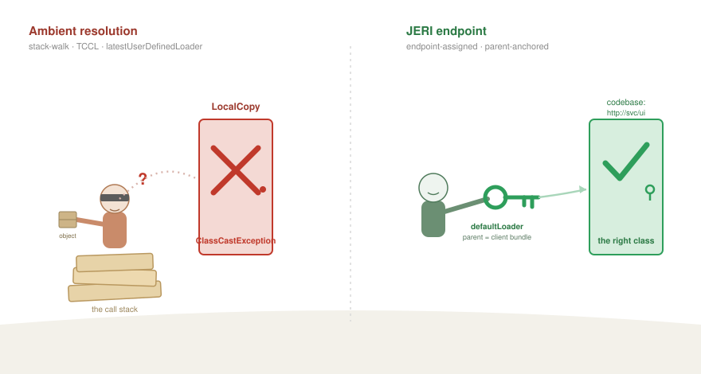

////
AsciiDoc version of Part 7, for Nicolas Frankel's preview branch.
Notes for publication:
  * Prepend the site's front matter (title/date/tags/layout) per the blog template.
  * Internal cross-links (link:blog-post-N[...]) point at the relative draft names;
    remap them to the published part URLs.
  * images/wrong-loader-right-key.svg is a DRAFT placeholder cartoon — replace with
    the finished illustration; keep the caption.
  * The [plantuml] block renders via asciidoctor-diagram at build (no pre-rendered SVG needed).
////
= Part 7 — Class Resolution: Loaders at the Endpoints, a Stream per Proxy
:source-highlighter: rouge
:icons: font

[.lead]
This post continues the JGDMS and DirtyChai series. link:blog-post-6-der-jeri[Part 6]
was about the wire _format_ — DER, schema, decoupling data from code. This one is
about what happens when those bytes arrive: turning them back into the _right_
classes. The series index is at the bottom.

Deserialization has two halves, and the industry obsesses over one of them. The
first half — _are these bytes safe to turn into objects?_ — gets all the attention,
because that is where the gadget-chain CVEs live, and link:blog-post-4-authorization[Part 4]
and link:blog-post-6-der-jeri[Part 6] are largely about it. The second half is quieter
and, in a distributed system, just as load-bearing: _which class does the name in the
stream actually refer to?_

That question sounds trivial until you have more than one class loader — and a
distributed system always does, because the whole point is that code arrives from
somewhere else. Two services can ship a class with the same name from different
codebases. A proxy's implementation lives in a loader the receiver has never seen.
Under OSGi there are dozens of isolated bundle loaders and no single "the" loader at
all. Get the resolution wrong and you do not get a security hole — you get a
`ClassCastException` between two classes that have the same name, or a class silently
resolved to the wrong, local copy, or an `EntryRep` that won't unmarshal. Sun's Jim
Warres catalogued these failures two decades ago in _Class Loading Issues in Java RMI
and Jini_ (TR-2006-149), and most frameworks still have them.

JGDMS doesn't, and the reason is two design decisions that are worth stating plainly
because almost nothing else makes them: *the stream endpoint assigns the loader that
resolves classes*, and *every proxy travels in its own stream*.

.The stack-walk delivers to whoever's home. The endpoint knows the address — and hands over the key.

== The Warres problem: resolution by accident

Standard Java serialization resolves classes with a heuristic. `ObjectInputStream.resolveClass`
walks the call stack looking for the "latest user-defined class loader" and uses
that — or it falls back to the thread context class loader. Both are _ambient_: they
depend on who happens to be on the stack, or on whatever some earlier code set the
TCCL to, neither of which is visible in any method signature.

The failure modes Warres documents all follow from that ambiguity. *Undesired local
resolution*: the heuristic finds a local copy of a class and uses it instead of the
one the sender annotated with a codebase, so the object deserialises into the wrong
type. *Type conflicts*: two codebases define the same class name and the runtime can't
keep them straight, because to the JVM a type's identity is `(name, defining loader)`
and the heuristic has thrown the loader away. *Annotation loss*: the codebase that
should have driven resolution never reaches the decision.

Under OSGi this stops being a subtle bug and becomes an outright wall. There is no
"latest user-defined loader" that means anything, and the TCCL is whatever the
framework happened to leave it — so the heuristic simply cannot find a class that lives
in another bundle. This is why `java.util.ServiceLoader` is famously broken in OSGi,
and why serialization-based RPC — Java RMI, Hessian/Burlap, Spring remoting, serialised
JMS payloads — doesn't work cleanly there either. They all resolve through the
consumer's ambient loader, and across a bundle boundary that loader can't see the
provider.

== The fix, half one: the endpoint assigns the loader

JGDMS's JERI (the Jini Extensible Remote Invocation stack) refuses the heuristic. Its
`MarshalInputStream` doesn't guess; it is _handed_ the loader to resolve against. The
stream carries an explicit `defaultLoader` field, and its `resolveClass` reads the
per-class codebase annotation and calls

[source,java]
----
ClassLoading.loadClass(codebase, name, defaultLoader, verifyIntegrity, verifierLoader);
----

— never `latestUserDefinedLoader`, never the TCCL. Resolution is a deterministic
function of _the codebase on the wire_ and _a loader chosen by the receiving
endpoint_, not of whatever is on the stack.

And the endpoint chooses it deliberately. On the dispatch side,
`BasicInvocationDispatcher` builds the input stream with a loader from
`getStreamLoader(impl)` — the loader configured for that dispatcher, or the service
implementation's own loader — and passes it as both the default and the verifier
loader. The loader that resolves the arguments of a remote call is the loader that
belongs to _that endpoint_, fixed at the point the connection is handled, not inherited
from an accident of the call stack.

The crucial detail — and the piece that makes it correct rather than merely
deterministic — is *what that loader becomes*. `ClassLoading.loadClass` doesn't just
pick a loader to call; it builds (or finds) the proxy's `PreferredClassLoader` for the
annotated codebase *with `defaultLoader` as its parent*. So the receiver's loader sits
at the top of the chain, and the downloaded proxy's loader hangs beneath it. That
parentage is doing real work:

* The *shared API* — the service interfaces the receiver compiled against, which live
in _the receiver's_ loader — resolves through the parent. Client and proxy therefore
share the _same_ interface `Class`, with one type identity. No type conflict, no
annotation mixing: the contract type is the receiver's, by construction.
* The proxy's *implementation* classes are loaded child-first (this is what
"preferred" means in `PreferredClassLoader`), so they stay isolated in the proxy's own
loader and never collide with anything the receiver or another proxy happens to have.

In OSGi this lands exactly where it should: the parent is the *client bundle's* loader.
The proxy resolves its shared interfaces to the client bundle's versions — the correct,
wired types — while its private implementation stays in its own preferred loader. The
endpoint-assigned, parent-anchored loader is the whole reason resolution is correct
across a bundle boundary where the ambient-loader heuristic fails. (`PreferredClassProvider`,
the SPI behind `ClassLoading`, is itself OSGi-aware — it carries the `osgi.serviceloader`
capability and participates in the bundle wiring.)

.Resolving a class name from the wire: the ambient stack-walk vs JERI's endpoint-assigned, parent-anchored loader
[plantuml,diagram7-class-resolution,svg]
....
@startuml
title Resolving a class name from the wire

skinparam shadowing false
skinparam defaultFontName Helvetica
skinparam ArrowColor #6E6E6E
skinparam rectangle {
  RoundCorner 10
  BorderColor #9A9A9A
}

rectangle "**Standard** ObjectInputStream.resolveClass" as A0 #EFEFEF
rectangle "walk the call stack →\n**latestUserDefinedLoader**  (or the TCCL)" as A1 #FBE9E7
rectangle "a loader picked by\n//whatever happens to be on the stack//" as A2 #FBE9E7
rectangle "**✗**  local copy / wrong loader\ntype conflict · undesired local resolution\n(and no loader to find across bundles under OSGi)" as A3 #F4B5AE
A0 --> A1
A1 --> A2
A2 --> A3

rectangle "**JERI** MarshalInputStream.resolveClass" as B0 #EFEFEF
rectangle "**defaultLoader** assigned by the **endpoint**\n(BasicInvocationDispatcher) + the codebase on the wire" as B1 #E6F4EA
rectangle "ClassLoading.loadClass(codebase, name, defaultLoader)\n→ PreferredClassLoader[codebase],\n**parent = defaultLoader**  (= client bundle under OSGi)" as B2 #E6F4EA
rectangle "**✓**  shared API via the parent → one type identity\nimpl child-first → isolated\n= the right class, deterministically" as B3 #B7E1C4
B0 --> B1
B1 --> B2
B2 --> B3

A0 -[hidden]down- B0

note bottom of B3
  No call stack, no TCCL: resolution is a function of the wire
  **codebase** and the **endpoint's loader** — nothing ambient.
end note
@enduml
....

== The fix, half two: a stream per proxy

The second decision is the one almost no one makes. In standard serialization the
whole object graph is *one* stream — one handle table, one shared class-descriptor
space, one resolution context for everything in it. Every object can back-reference
every other; the loader context is global to the stream.

JGDMS marshals each proxy, and its entire object tree, in *its own* stream. Look at how
the reggie lookup service stores a service: the `Item` it holds has a `serviceID`, a
`serviceType`, a codebase string — and the actual proxy is a field of type
`MarshalledWrapper`, not the proxy itself. `MarshalledWrapper` wraps a
`MarshalledInstance`: a fully self-contained sub-stream, with its own codebase
annotation, its own handle table, and (because of half one) its own resolution context.
The outer `Item` stream contains only opaque bytes where the proxy is; the proxy is
decoded *separately and lazily*, on demand, by `get()`, against its own loader and its
own integrity setting.

That isolation buys three things that a single shared stream cannot, and each maps onto
a Warres failure or a security property:

* *Type-identity isolation.* Each proxy resolves against _its own_ codebase via its own
preferred loader. Two services that ship a same-named class from different codebases
never meet — they were never in the same stream or the same loader, so the "type
conflict" simply cannot arise.
* *Fault isolation.* A proxy whose codebase is unreachable fails _only its own_ `get()`.
You can still read every other item's `serviceID` and type and decode every other proxy.
One dead codebase cannot sink the batch — the same property we were careful to preserve,
attribute by attribute, in the `MarshalledObject` → `MarshalledInstance` migration of
link:blog-post-6-der-jeri[Part 6].
* *Security isolation.* Separate streams mean separate handle tables, so a hostile
proxy's object tree cannot hold a reference into another proxy's tree. A gadget chain
cannot thread from one proxy to the next, and each tree is reconstructed in its own
loader-and-integrity context rather than in one shared blast radius.

== Why this is the OSGi answer

Put the two halves together with link:blog-post-6-der-jeri[Part 6]'s per-level domains
and you have a resolution model that is _per-context all the way down_: each inheritance
level resolved by its own defining loader, each proxy resolved in its own stream against
an endpoint-assigned, parent-anchored loader, each codebase its own namespace. Nothing
depends on the call stack or the thread-context loader — the two ambient mechanisms that
OSGi breaks.

That is the substantive reason JGDMS works under OSGi where mainstream serialization-RPC
does not. Its SPI lookup deliberately uses the *OSGi service registry* for cross-bundle
providers — discovery formats, `Configuration` — because it knows `ServiceLoader`'s
classpath scan can't cross a bundle boundary; and it resolves *co-loaded* providers (the
per-package marshalling delegates) by scanning the _provider's own_ loader, which works
precisely because it scans the loader that holds the provider rather than the consumer's.
Two relationships, two correct mechanisms — instead of one ambient heuristic that gets
both wrong.

I'll put the strong claim carefully, because it's the kind that deserves a caveat rather
than a flourish: I know of no other remote-invocation framework that solves
deserialization class resolution under OSGi, and the ambient-loader approach that the
mainstream ones share provably doesn't. Whether JGDMS is _literally_ the only one is a
universal I can't prove by inspection — but it is, at minimum, doing something here that
the usual stack is not even attempting.

== What it costs

The honest price is conceptual weight. "The endpoint owns the resolving loader" and
"every proxy is its own stream" are more machinery than "call `readObject` and hope," and
they only pay off in exactly the conditions — multiple codebases, mixed trust, bundle
isolation — that a single-JVM demo never exercises. That is the recurring shape of this
whole series: the cost is paid up front, by the framework and the person who learns the
model, so that it is not paid later, as a `ClassCastException` nobody can reproduce or a
proxy that loads fine until the one codebase you needed is down. Resolution by design,
not by accident — the same discipline as the rest, applied to the half of deserialization
everyone forgets.

'''

== Series index

[cols="1,5,2",options="header"]
|===
| # | Title | Depends on
| 1 | link:blog-post-1-why-fork[Overview: why fork both Apache River and OpenJDK?] | —
| 2 | link:blog-post-2-scap[SCAP: auditing JARs before they are loaded] | — (standalone)
| 3a | link:blog-post-3a-identity-model[The identity model: three principals on every dispatch thread] | 1
| 3b | link:blog-post-3b-multi-subject[Multi-Subject dispatch and distributed transaction authorization] | 3a
| 4 | link:blog-post-4-authorization[Authorization without a single point of trust] | 2, 3a
| 5 | link:blog-post-5-performance[Virtual threads, lock-free policy, and why security does not have to be slow] | 1–4
| 6 | link:blog-post-6-der-jeri[Decoupling data from code: DER on the JERI wire] | 4
| *7* | *Class resolution: loaders at the endpoints, a stream per proxy* _(this post)_ | 6
|===

'''

_GitHub repositories:_

* _JGDMS: https://github.com/pfirmstone/JGDMS_
* _DirtyChai: https://github.com/pfirmstone/DirtyChai_
