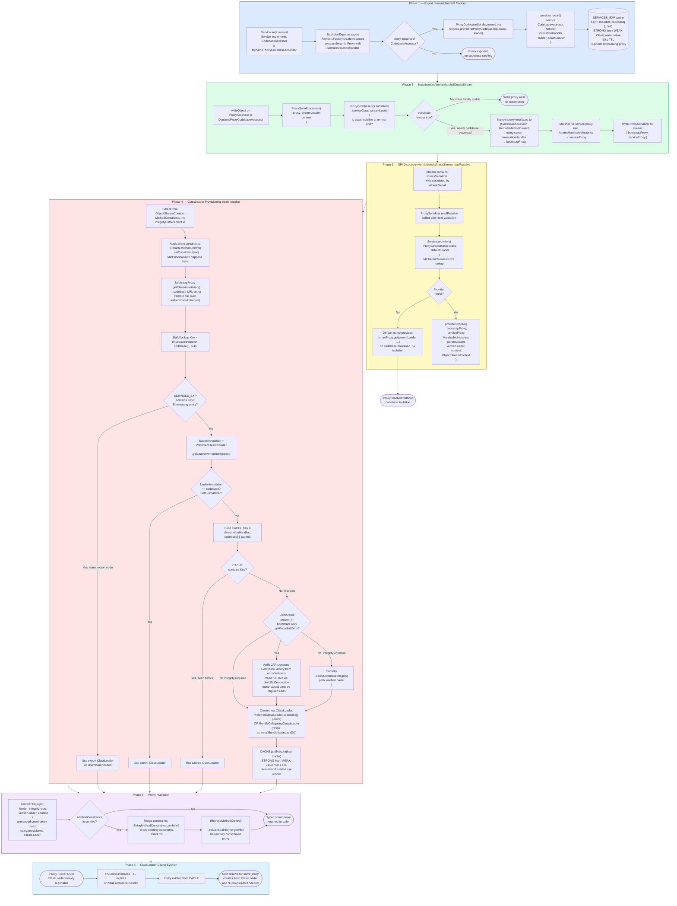

# Service and Proxy Life Cycles

This document illustrates three complete, interlocking life cycles in JGDMS:

1. **[Service Start / Runtime / Shutdown Life Cycle](#1-service-start--runtime--shutdown-life-cycle)** —
   how a service is launched by `ServiceStarter`, constructed, exported, joined to lookup services,
   kept alive through lease management, and ultimately destroyed via `DestroyAdmin`.

2. **[Service Discovery Life Cycle](#2-service-discovery-life-cycle)** — how a service moves from
   registration in a lookup service through discovery, bootstrap preparation, filtering, and caching
   inside `ServiceDiscoveryManager` and `LookupCacheImpl`.

3. **[ProxyCodebaseSpi Life Cycle](#3-proxycodebasespi-life-cycle)** — how a smart proxy's codebase
   is recorded at export time, serialised into a stream, and resolved back into a typed object on the
   client side with per-service `ClassLoader` isolation.

---

## 1. Service Start / Runtime / Shutdown Life Cycle

### 1.1 Overview Flowchart

```mermaid
flowchart TD
    subgraph ENTRY ["Phase 1 — ServiceStarter Entry Point"]
        E1(["ServiceStarter.main(args)\nor main(config)"]) --> E2
        E2[ensureSecurityManager\ninstall CombinerSecurityManager\nif none present] --> E3
        E3["ConfigurationProvider\n.getInstance(args)\n→ Configuration"] --> E4
        E4{"loginContext\nin config?"} -- Yes --> E5
        E4 -- No --> E6
        E5["LoginContext.login\nSubject.doAsPrivileged\n  → create(descs, config)\nLoginContext.logout"] --> E6
        E6["for each ServiceDescriptor:\n  desc.create(config)"] --> E7
        E7["maintainNonActivatableReferences\nstore strong refs to\nnon-activatable service proxies\n(prevent GC)"]
    end

    subgraph NASD ["Phase 2a — NonActivatableServiceDescriptor.create()"]
        NA1["Create ExportClassLoader:\n  importCodebase URLs (server impl)\n  exportCodebase URLs (stubs/proxy)\n  parent = current context loader"] --> NA2
        NA2["Wrap in DynamicPolicyProvider\nif not already dynamic"] --> NA3
        NA3["LoadClass.forName(implClassName,\n  false, newClassLoader)\nSet thread contextClassLoader"] --> NA4
        NA4{"Configuration\nor String[] args?"} -- Configuration --> NA5A
        NA4 -- String[] args --> NA5B
        NA5A["constructor(Configuration, LifeCycle)"] --> NA6
        NA5B["constructor(String[], LifeCycle)"] --> NA6
        NA6[constructor.newInstance\nService impl created] --> NA7
        NA7{"impl instanceof\nStartable?"} -- Yes --> NA8
        NA7 -- No --> NA9
        NA8["impl.start()\n(see Phase 3)\nthreads/export deferred\nuntil construction complete"] --> NA9
        NA9{"impl instanceof\nServiceProxyAccessor?"} -- Yes --> NA10
        NA9 -- No → ProxyAccessor? --> NA11
        NA9 -- Neither --> NA12
        NA10["impl.getServiceProxy()\n→ proxy"] --> NA13
        NA11["impl.getProxy()\n→ proxy"] --> NA13
        NA12["proxy = null"] --> NA13
        NA13["Marshal + unmarshal proxy\nvia AtomicMarshalledInstance\n(preserves codebase annotation)"] --> NA14
        NA14["servicePreparer\n.prepareProxy(proxy)"] --> NA15
        NA15["return Created(impl, proxy)\nServiceStarter holds\nstrong ref to impl"]
    end

    subgraph SASD ["Phase 2b — Activatable Path (SharedActivatableServiceDescriptor.create())"]
        AC0["SharedActivationGroupDescriptor\n.create() — run first if group\nnot yet registered"] --> AC1
        AC0A["ActivationSystem.registerGroup\n(ActivationGroupDesc)\n→ ActivationGroupID\nPersist gid to sharedGroupLog"] --> AC1
        AC1["ServiceStarter\n.getActivationSystem(host, port, config)\n→ prepared ActivationSystem proxy"] --> AC2
        AC2["Build ActivateWrapper.ActivateDesc\n(implClass, importURLs, exportURLs,\n policy, configArgs)"] --> AC3
        AC3["SharedActivationGroupDescriptor\n.restoreGroupID(sharedGroupLog)\n→ ActivationGroupID"] --> AC4
        AC4["ActivateWrapper.register\n(gid, adesc, restart, sys)\n→ raw ActivationID"] --> AC5
        AC5["activationIDPreparer\n.prepareProxy(rawAid)\n→ prepared ActivationID"] --> AC6
        AC6["aid.activate(true)\n(activates the service JVM\n in the shared group)"] --> AC7
        AC7["innerProxyPreparer\n.prepareProxy(innerProxy)"] --> AC8
        AC8{"innerProxy instanceof\nServiceProxyAccessor?"} -- Yes --> AC9
        AC8 -- No --> AC10
        AC9["innerProxy.getServiceProxy()\n→ outerProxy\nservicePreparer.prepareProxy\n(outerProxy)"] --> AC11
        AC10["Use innerProxy directly"] --> AC11
        AC11["return Created\n(gid, aid, proxy)"]
        ACERR["Exception during create:\nsys.unregisterObject(aid)\nre-throw"] -.-> AC11
    end

    subgraph START ["Phase 3 — Service Startup  Startable.start()"]
        ST1{"Persistent service?\nlog != null"} -- Yes --> ST2
        ST1 -- No, fresh start --> ST3
        ST2["log.recover(classLoader)\nrestore registrations,\nevents, attributes\nfrom persistent log"] --> ST3
        ST3["Generate ServiceID if new\ncomputeMaxLeases"] --> ST4
        ST4["serverExporter.export(this)\n→ stub / remote ref"] --> ST5
        ST5["Build proxy:\nRegistrarProxy.getInstance(stub, sid)"] --> ST6
        ST6["Self-register:\naddService(SvcReg(item,\n  myLeaseID, MAX_VALUE))\nlog.snapshot()"] --> ST7
        ST7["DiscoveryGroupManagement\n  .setGroups(lookupGroups)\n DiscoveryLocatorManagement\n  .setLocators(lookupLocators)"] --> ST8
        ST8["JoinManager(proxy, attrs,\n  serviceID, discoer, null, config)\nJoin discovered lookup services\nRenew lookup-service leases"] --> ST9
        ST9["Start daemon threads:\nserviceExpirer\neventExpirer\nunicaster\nmulticaster\nannouncer\neventNotifierExec\nsnapshotter"] --> ST10
        ST10["Register JVM shutdown hook:\nannouncer.interrupt+join\n(final multicast announcement)"]
    end

    subgraph RUNTIME ["Phase 4 — Service Runtime: Lease Management"]
        LM1(["Client: register(item, leaseDuration)\nor notify(tmpl, trans, listener, hand, dur)"])
        LM1 --> LM2["Create SvcReg or EventReg\nwith leaseID and leaseExpiration\nStore in serviceByID / eventByID maps\nordered by leaseExpiration"]
        LM2 --> LM3["Return ServiceRegistration\nor EventRegistration\nwith Lease"]
        LM3 --> LM4(["Client holds Lease\nmust call lease.renew() before expiry"])

        LE1(["serviceExpirer / eventExpirer\nthread wakes when\nnext expiry is due"]) --> LE2
        LE2["Check leaseExpiration\n<= currentTimeMillis"] --> LE3
        LE3{"Expired?"} -- Yes --> LE4
        LE3 -- No, sleep until next expiry --> LE1
        LE4["Remove SvcReg or EventReg\nfrom maps\nSend MATCH_NOMATCH event\nif service reg expired"]

        LR1(["Client: lease.renew(duration)"])
        LR1 --> LR2["renewLease(serviceID, leaseID, dur)\nor renewEventLease(eventID, leaseID, dur)"]
        LR2 --> LR3["Update leaseExpiration\nin map\nlog renewal record"]

        LC1(["Client: lease.cancel()"])
        LC1 --> LC2["cancelServiceLease / cancelEventLease\nRemove registration from maps\nlog cancellation"]
    end

    subgraph DESTROY ["Phase 5 — Destroy  DestroyAdmin.destroy()"]
        DV1(["Client proxy calls\nDestroyAdmin.destroy()"])
        DV1 --> DV2["RegistrarImpl.destroy:\nacquire priorityWriteLock\n(drains in-flight calls)"]
        DV2 --> DV3{"Activatable?\nactivationID != null"} -- Yes --> DV4
        DV3 -- No --> DV5
        DV4["activationSystem\n.unregisterObject(activationID)\n(deregister from activation daemon)"] --> DV5
        DV5["Spawn non-daemon Destroy thread\nrelease write lock\nreturn to caller\n(async destroy)"] --> DV6
        DV6["Graceful unexport:\nserverExporter.unexport(false)\nwait up to 10 × 1 s for\nin-flight RMI calls to finish"] --> DV7
        DV7{"Unexported?"} -- No, still busy --> DV8
        DV7 -- Yes --> DV9
        DV8["serverExporter.unexport(true)\n(force)"] --> DV9
        DV9["Interrupt daemon threads:\nserviceExpirer, eventExpirer,\nunicaster, multicaster,\nannouncer, snapshotter\nshutdown eventNotifierExec\nshutdownNow discoveryResponseExec"] --> DV10
        DV10["joiner.terminate()\ndiscoer.terminate()"] --> DV11
        DV11["Join all interrupted threads\n(wait for clean termination)"] --> DV12
        DV12{"Persistent?\nlog != null"} -- Yes --> DV13
        DV12 -- No --> DV14
        DV13["log.deletePersistentStore()\nremove snapshot + log files"] --> DV14
        DV14{"Activatable?\nactivationID != null"} -- Yes --> DV15
        DV14 -- No --> DV16
        DV15["ActivationGroup.inactive\n(activationID, serverExporter)\nSignal activation daemon\nservice is idle"] --> DV16
        DV16{"lifeCycle != null?"} -- Yes --> DV17
        DV16 -- No --> DV18
        DV17["lifeCycle.unregister(impl)\nServiceStarter releases\nstrong ref to impl"] --> DV18
        DV18{"loginContext != null?"} -- Yes --> DV19
        DV18 -- No --> DONE2
        DV19["loginContext.logout()"] --> DONE2([Shutdown complete])
    end

    ENTRY --> NASD
    ENTRY --> SASD
    NASD --> START
    SASD --> START
    START --> RUNTIME
    RUNTIME --> DESTROY

    style ENTRY fill:#dbeafe,stroke:#1d4ed8
    style NASD fill:#dcfce7,stroke:#15803d
    style SASD fill:#fef9c3,stroke:#a16207
    style START fill:#f3e8ff,stroke:#7e22ce
    style RUNTIME fill:#e0f2fe,stroke:#0369a1
    style DESTROY fill:#fce7f3,stroke:#9d174d
```

### 1.2 Deployment Path Comparison

| Aspect | Non-activatable (`NonActivatableServiceDescriptor`) | Shared-activatable (`SharedActivatableServiceDescriptor`) |
|---|---|---|
| **JVM hosting** | Caller's JVM (ServiceStarter process) | Separate JVM in shared `ActivationGroup` |
| **Constructor signature** | `(String[], LifeCycle)` or `(Configuration, LifeCycle)` | `ActivateWrapper` constructor: `(ActivationID, MarshalledObject)` |
| **Activation system** | Not used | Required — `ActivationSystem` must be running |
| **Restart on JVM crash** | No | Yes, if `restart=true` in descriptor |
| **Proxy acquisition** | `Startable.start()` → `ServiceProxyAccessor.getServiceProxy()` or `ProxyAccessor.getProxy()` then marshal/unmarshal | `ActivationID.activate(true)` → inner proxy → optionally `ServiceProxyAccessor.getServiceProxy()` |
| **Inner proxy preparer** | N/A (single preparer) | `innerProxyPreparer` applied before `getServiceProxy()` call |
| **GC protection** | `ServiceStarter.transient_service_refs` holds strong ref | Activation daemon holds registration; no strong ref needed |
| **Deregistration** | `LifeCycle.unregister(impl)` releases strong ref | `ActivationSystem.unregisterObject(aid)` during destroy |

### 1.3 Key Interfaces and Their Roles

| Interface / Class | Role in Lifecycle |
|---|---|
| `ServiceDescriptor` | Common contract: `create(Configuration) → Object` |
| `Startable` | Defers export and thread start until after construction (JMM-safe publication) |
| `LifeCycle` | Single method `unregister(impl)`: lets the service signal ServiceStarter to release its strong reference |
| `DestroyAdmin` | Remote admin interface: `destroy()` triggers async `Destroy` thread |
| `JoinManager` | Handles multicast discovery + event registration with lookup services; renews lookup leases |
| `ServiceExpire` / `EventExpire` | Daemon threads that expire service and event leases in the lookup service's own registry |
| `ActivateWrapper` | Wraps service impl for activatable deployment; enforces per-service import/export codebase and policy |
| `SharedActivationGroupDescriptor` | Creates and persists the `ActivationGroupID` log that `SharedActivatableServiceDescriptor` reads |

---

## 2. Service Discovery Life Cycle

### 2.1 Overview Flowchart

### 2.2 Extension Points Quick Reference

| Lifecycle Point | Class / File | Extension Interface | Isolation Granularity |
|---|---|---|---|
| Registrar discovered | `ServiceDiscoveryManager` L875–876 | `ProxyPreparer` (`registrarPreparer`) | Per lookup service |
| Event lease prepared | `ServiceDiscoveryManager` L2258 | `ProxyPreparer` (`eventLeasePreparer`) | Per registration |
| Bootstrap proxy prepared (snapshot) | `LookupCacheImpl` L854–869 | `ProxyPreparer` (`bootstrapProxyPreparer`) | Per service item |
| Bootstrap proxy prepared (event) | `LookupCacheImpl` L1020 | Same `bootstrapProxyPreparer` | Per service event |
| Service proxy downloaded (no filter) | `LookupCacheImpl` L2116 | `ServiceProxyAccessor.getServiceProxy()` | Per service item |
| First-stage filter applied | `LookupCacheImpl` L2129, 2132 | `ServiceItemFilter` | Per service item (cached) |
| Filter retry on indefinite | `LookupCacheImpl` L493–558 | Same `ServiceItemFilter` | Per service item |
| Second-stage filter at cache lookup | `LookupCacheImpl` L827 | `ServiceItemFilter` (per-call) | Per call (isolated instance) |
| SDM direct lookup filter | `ServiceDiscoveryManager` L1760, 2044 | `ServiceItemFilter` | Per call (not cached) |
| Client discard | `LookupCacheImpl` L724–773 | — | Per service item |
| Registrar dropped | `LookupCacheImpl` L926–945 | — | All services from that registrar |

---

## 3. ProxyCodebaseSpi Life Cycle

### 3.1 Overview Flowchart

### 3.2 ClassLoader Resolution Decision Tree

### 3.3 Phase Summary

| Phase | Key classes | Purpose |
|---|---|---|
| **① Export / record** | `AtomicILFactory.createInstances`, `ProxyCodebaseSpi.record` | Stores `(InvocationHandler, codebase) → ClassLoader` in `SERVICES_EXP` to support boomerang proxies returning to their export node. Not idempotent — throws `ExportException` if called twice. |
| **② Serialisation / substitute** | `AtomicMarshalOutputStream`, `ProxySerializer.create`, `ProxyCodebaseSpi.substitute` | Decides whether the proxy class is invisible at the remote end. If so, replaces it with a `ProxySerializer` holding a narrowed *bootstrapProxy* (`[CodebaseAccessor, RemoteMethodControl]`) and the full proxy inside an `AtomicMarshalledInstance`. |
| **③ SPI discovery** | `ProxySerializer.readResolve`, `Service.providers` | Locates the active `ProxyCodebaseSpi` implementation via `META-INF/services`. Falls back to a no-op default (no isolation, no download). |
| **④ Constraint application** | `RemoteMethodControl.setConstraints`, stream context | Client-side `MethodConstraints` and `IntegrityEnforcement` extracted from `ObjectStreamContext`, applied to `bootstrapProxy` before any remote calls (MinPrincipal authentication enforced here). |
| **⑤ ClassLoader provisioning** | `SERVICES_EXP`, `CACHE`, parent annotation check | Four-path priority: boomerang → self-unmarshal → cached → new. New loaders are verified before creation. |
| **⑥ Codebase integrity** | `Security.verifyCodebaseIntegrity`, `CertificateFactory`, `JarURLConnection` | URL-based or certificate-based JAR signature verification, depending on whether `bootstrapProxy.getEncodedCerts()` returns data. |
| **⑦ ClassLoader creation** | `PreferredClassLoader` (non-OSGi), `BundleDelegatingClassLoader` (OSGi) | New loader created as child of stream's parent loader. OSGi path installs a bundle. Stored with `putIfAbsent` to handle concurrent races safely. |
| **⑧ Proxy hydration** | `MarshalledInstance.get`, `RemoteMethodControl.setConstraints` | Smart proxy unmarshalled using provisioned `ClassLoader`. Client constraints merged with proxy's existing constraints via `StringMethodConstraints.combine()`. |
| **⑨ Cache eviction** | `RC.concurrentMap`, weak references, 60 s TTL | `ClassLoader` values held via weak references + 60 s expiry. On eviction the next `resolve()` recreates the loader. |

---

## 4. How the Three Life Cycles Connect

The **Service Start / Runtime / Shutdown** life cycle produces the running service and keeps it
registered in lookup services via `JoinManager`. The **Service Discovery** life cycle detects that
registration from the client side. The **ProxyCodebaseSpi** life cycle handles the class-loading of
the downloaded smart proxy.

```mermaid
flowchart LR
    subgraph SVCSTART ["Service Start Life Cycle"]
        SS1[Startable.start:\nexport + JoinManager] --> SS2
        SS2[JoinManager joins\nlookup services\nregisters ServiceItem]
    end

    subgraph SDM ["Service Discovery Life Cycle"]
        SD1[Registrar discovered] --> SD2
        SD2[Bootstrap proxy\nprepared] --> SD3
        SD3["ServiceItemFilter.check\nfirst stage"] --> SD4
        SD4["getServiceProxy\ndownloads ProxySerializer\nfrom stream"] --> SD5
        SD5["filter stores\nprepared proxy\nin filteredItem"] --> SD6
        SD6["LookupCache.lookup\nsecond-stage filter\nper-caller clone"]
    end

    subgraph SPI ["ProxyCodebaseSpi Life Cycle"]
        SP1["ProxySerializer\nin stream"] --> SP2
        SP2["readResolve calls\nprovider.resolve"] --> SP3
        SP3["ClassLoader provisioned\nor boomerang / cached"] --> SP4
        SP4["serviceProxy.get(loader)\nunmarshals typed proxy"] --> SP5
        SP5[Constraints merged\nproxy returned]
    end

    SS2 -- "Service appears in\nlookup service registry" --> SD1
    SD4 -- "AtomicMarshalInputStream\ndeserialises ProxySerializer" --> SP1
    SP5 -- "Typed proxy\nhanded back to filter\nas item.service" --> SD5

    style SVCSTART fill:#fef9c3,stroke:#a16207
    style SDM fill:#dbeafe,stroke:#1d4ed8
    style SPI fill:#dcfce7,stroke:#15803d
```

The three connection points are:

1. `JoinManager` (Phase 3 of the Start life cycle) registers the service's proxy in discovered
   lookup services. This is what the client-side `ServiceDiscoveryManager` observes as a new
   service (Phase 1 of the Discovery life cycle).

2. `ServiceItemFilter.check()` (Phase 5 of the Discovery life cycle) drives the proxy download by
   calling `((ServiceProxyAccessor) item.service).getServiceProxy()` — a remote call to the
   bootstrap proxy's authenticated endpoint.

3. The returned stream contains a `ProxySerializer` object. `AtomicMarshalInputStream` calls its
   `readResolve`, which delegates to the active `ProxyCodebaseSpi.resolve` (Phase 3 of the
   ProxyCodebaseSpi life cycle). The SPI provisions the correct `ClassLoader`, unmarshals the
   smart proxy, merges client constraints, and returns the fully typed, constrained proxy.
   The filter stores it as `filteredItem` and returns pass.
