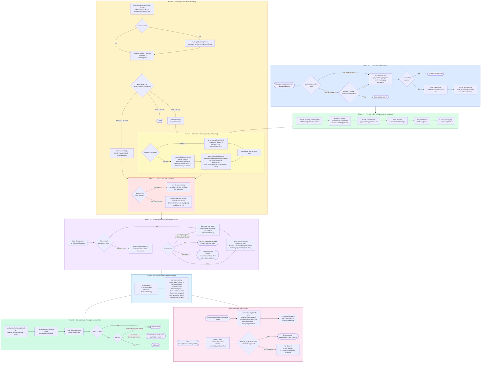
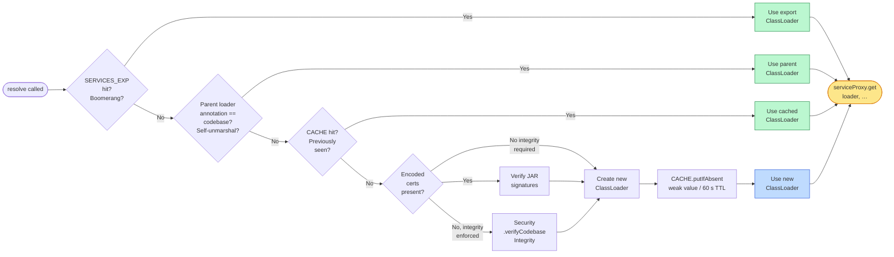
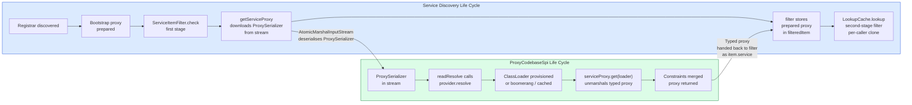

# Service and Proxy Life Cycles

This document illustrates two complete, interlocking life cycles in JGDMS:

1. **[Service Discovery Life Cycle](#1-service-discovery-life-cycle)** — how a service moves from
   registration in a lookup service through discovery, bootstrap preparation, filtering, and caching
   inside `ServiceDiscoveryManager` and `LookupCacheImpl`.

2. **[ProxyCodebaseSpi Life Cycle](#2-proxycodebasespi-life-cycle)** — how a smart proxy's codebase
   is recorded at export time, serialised into a stream, and resolved back into a typed object on the
   client side with per-service `ClassLoader` isolation.

---

## 1. Service Discovery Life Cycle

### 1.1 Overview Flowchart

### 1.2 Extension Points Quick Reference

| Lifecycle Point | Class / File | Extension Interface | Isolation Granularity |
|---|---|---|---|
| Registrar discovered | `ServiceDiscoveryManager` L875–876 | `ProxyPreparer` (`registrarPreparer`) | Per lookup service |
| Event lease prepared | `ServiceDiscoveryManager` L2258 | `ProxyPreparer` (`eventLeasePreparer`) | Per registration |
| Bootstrap proxy prepared (snapshot) | `LookupCacheImpl` L854–869 | `ProxyPreparer` (`bootstrapProxyPreparer`) | Per service item |
| Bootstrap proxy prepared (event) | `LookupCacheImpl` L1020 | Same `bootstrapProxyPreparer` | Per service event |
| Service proxy downloaded (no filter) | `LookupCacheImpl` L2116 | `ServiceProxyAccessor.getServiceProxy()` | Per service item |
| First-stage filter applied | `LookupCacheImpl` L2129, 2132 | `ServiceItemFilter` | Per service item (cached) |
| Filter retry on indefinite | `LookupCacheImpl` L493–558 | Same `ServiceItemFilter` | Per service item |
| Second-stage filter at cache lookup | `LookupCacheImpl` L827 | `ServiceItemFilter` (per-call) | Per call (isolated instance) |
| SDM direct lookup filter | `ServiceDiscoveryManager` L1760, 2044 | `ServiceItemFilter` | Per call (not cached) |
| Client discard | `LookupCacheImpl` L724–773 | — | Per service item |
| Registrar dropped | `LookupCacheImpl` L926–945 | — | All services from that registrar |

---

## 2. ProxyCodebaseSpi Life Cycle

### 2.1 Overview Flowchart

### 2.2 ClassLoader Resolution Decision Tree

### 2.3 Phase Summary

| Phase | Key classes | Purpose |
|---|---|---|
| **① Export / record** | `AtomicILFactory.createInstances`, `ProxyCodebaseSpi.record` | Stores `(InvocationHandler, codebase) → ClassLoader` in `SERVICES_EXP` to support boomerang proxies returning to their export node. Not idempotent — throws `ExportException` if called twice. |
| **② Serialisation / substitute** | `AtomicMarshalOutputStream`, `ProxySerializer.create`, `ProxyCodebaseSpi.substitute` | Decides whether the proxy class is invisible at the remote end. If so, replaces it with a `ProxySerializer` holding a narrowed *bootstrapProxy* (`[CodebaseAccessor, RemoteMethodControl]`) and the full proxy inside an `AtomicMarshalledInstance`. |
| **③ SPI discovery** | `ProxySerializer.readResolve`, `Service.providers` | Locates the active `ProxyCodebaseSpi` implementation via `META-INF/services`. Falls back to a no-op default (no isolation, no download). |
| **④ Constraint application** | `RemoteMethodControl.setConstraints`, stream context | Client-side `MethodConstraints` and `IntegrityEnforcement` extracted from `ObjectStreamContext`, applied to `bootstrapProxy` before any remote calls (MinPrincipal authentication enforced here). |
| **⑤ ClassLoader provisioning** | `SERVICES_EXP`, `CACHE`, parent annotation check | Four-path priority: boomerang → self-unmarshal → cached → new. New loaders are verified before creation. |
| **⑥ Codebase integrity** | `Security.verifyCodebaseIntegrity`, `CertificateFactory`, `JarURLConnection` | URL-based or certificate-based JAR signature verification, depending on whether `bootstrapProxy.getEncodedCerts()` returns data. |
| **⑦ ClassLoader creation** | `PreferredClassLoader` (non-OSGi), `BundleDelegatingClassLoader` (OSGi) | New loader created as child of stream's parent loader. OSGi path installs a bundle. Stored with `putIfAbsent` to handle concurrent races safely. |
| **⑧ Proxy hydration** | `MarshalledInstance.get`, `RemoteMethodControl.setConstraints` | Smart proxy unmarshalled using provisioned `ClassLoader`. Client constraints merged with proxy's existing constraints via `StringMethodConstraints.combine()`. |
| **⑨ Cache eviction** | `RC.concurrentMap`, weak references, 60 s TTL | `ClassLoader` values held via weak references + 60 s expiry. On eviction the next `resolve()` recreates the loader. |

---

## 3. How the Two Life Cycles Connect

The two life cycles meet at **Phase 3 of the Service Discovery life cycle** (Snapshot / Bootstrap
Proxy Processing) and at **Phase 5 / Filter download** (`ServiceProxyAccessor.getServiceProxy()`).

The `ServiceItemFilter` is responsible for driving the download:

1. It calls `((ServiceProxyAccessor) item.service).getServiceProxy()` (a remote call to the
   bootstrap proxy's endpoint).
2. The result is a serialised stream that `AtomicMarshalInputStream` deserialises.
3. `AtomicMarshalInputStream` encounters a `ProxySerializer` object and calls its `readResolve`.
4. `readResolve` delegates to the active `ProxyCodebaseSpi.resolve`, which provisions the correct
   `ClassLoader` and returns the fully typed, constrained smart proxy.
5. The filter replaces `item.service` with this proxy and returns pass.
6. The prepared proxy is stored as `filteredItem` and returned to callers of `LookupCache.lookup`.
